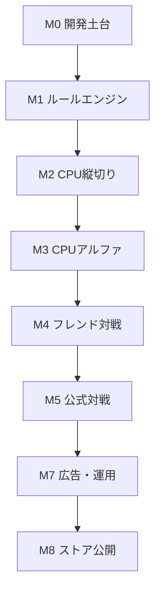

# 独自カードゲーム 横断マイルストーン・TODO

- 文書ID：GAME-PLAN-001
- 版数：0.1
- 文書状態：実行計画ドラフト
- 作成日：2026-08-27
- 基準文書：`独自カードゲーム_要件定義書_v0.1.md`
- 対象領域：Supabase、Expo、グラフィック、結合・QA

## 1. この計画の目的

Supabase、Expo、グラフィックを独立した工程として最後に結合するのではなく、各マイルストーンで「実際に動いて確認できる機能」を完成させる。

各マイルストーンは、次の4レーンを横断する。

| レーン | 略号 | 対象 |
|---|---|---|
| Supabase | SB | DB、認証、サーバー判定、Realtime、統計、運用 |
| Expo | EX | アプリ、ルールエンジン、画面、操作、通信、広告 |
| グラフィック | GR | カード、背景、アイコン、演出素材、ストア素材 |
| 結合・QA | QA | 結合、テスト、性能、受入、リリース判定 |

### 1.1 実現単位の定義

本計画の「実現単位」は、次をすべて満たす縦割りの機能とする。

1. 必要なデータまたはマスタが存在する。
2. Expo上でユーザーが操作できる。
3. 仮素材または本素材で状態が理解できる。
4. 正常系と主要な不正系をテストできる。
5. 完了条件を第三者が再現できる。

### 1.2 スケジュール前提

- 週番号は着手日を第1週とした相対表記である。
- 個人開発で週15～20時間を確保する想定の目安である。
- 週10時間の場合は、記載期間の約1.5～2倍を見込む。
- AIによる実装・テスト支援を使用するが、設計判断、実機確認、最終アート品質確認は本人が行う。
- グラフィック制作はM1から継続し、M6で最終品質へ収束させる。
- 各期間には20%程度の不確実性を含む。公式対戦の同期問題が大きい場合は追加バッファを確保する。

## 2. 全体マイルストーン

| ID | 目安 | 実現するもの | Supabase | Expo | グラフィック | リリース地点 |
|---|---|---|---|---|---|---|
| M0 | W1～2 | 開発土台とカードカタログ | 開発環境、マイグレーション、マスタ | 起動、画面遷移、環境切替 | アート方針、仮カード | 内部確認 |
| M1 | W3～6 | ローカル・ルールサンドボックス | ルール版・マスタ | 純粋ルールエンジン、デバッグ盤面 | 仮カード一式、状態アイコン | ルール検証版 |
| M2 | W7～12 | CPUと1局遊べる縦切り | 練習結果保存の土台 | CPU、対局画面、結果・再戦 | 昼夜背景、代表カード、基本演出 | CPUプロトタイプ |
| M3 | W13～18 | 全ルール対応CPU版 | プロフィール、統計、イベント | 全スキル、履歴、チュートリアル | 9階級、スキル、効果素材 | CPUアルファ |
| M4 | W19～28 | 2～6人フレンド対戦 | ルーム、対局状態、Realtime、再接続 | ロビー、オンライン対局、同期 | オンライン状態・ルームUI | クローズドα |
| M5 | W29～38 | 人間4人の公式対戦 | マッチング、公式結果、順位、不正防止 | 公式対戦、30秒、棄権、順位 | 公式対戦・結果・順位素材 | クローズドβ |
| M6 | W39～44 | 製品品質のグラフィックと性能 | アセット版管理 | 画像最適化、軽量設定、端末対応 | 全本番素材、演出最終化 | ビジュアルRC |
| M7 | W45～49 | 広告・分析・運用 | 同意、分析、運用ログ | 広告、規約、設定、障害表示 | ストア・同意・告知素材 | 収益化RC |
| M8 | W50～54 | ストア公開版 | 本番環境、監視、バックアップ | 実機E2E、ビルド、ストア申請 | 最終QA、ストア素材 | v1.0 |

### 2.1 リリースゲート

| ゲート | 到達時点 | 外部公開範囲 |
|---|---|---|
| G1 | M2完了 | 開発者・少人数のCPUプレイ確認 |
| G2 | M3完了 | CPU版の限定テスト |
| G3 | M4完了 | 招待制フレンド対戦α |
| G4 | M5完了 | 招待制公式対戦β |
| G5 | M8完了 | ストア一般公開 |

### 2.2 要件定義との対応

| マイルストーン | 主な要件範囲 |
|---|---|
| M0 | TERM-REQ、I18N、CARD、DATA-M |
| M1 | TURN、FLOW、FIELD、COMBO、SINGLE、RANKSET、SEQ、LOCK、SEAL、REV、JOKER、TX、WIN |
| M2 | SETUP、MODE-CPU、CPU、UI-BATTLEの基本、WIN |
| M3 | SKILL、VIS、EVENT、STAT、チュートリアル・履歴 |
| M4 | MODE-FRIEND、ROOM、CONN、NET、公開・非公開情報 |
| M5 | MODE-OFFICIAL、MATCH、TIMER、TIMEOUT、FORFEIT、RANKING、FAIR |
| M6 | UI、FX、I18N、NFR-P、アクセシビリティ |
| M7 | ADS、OPS、ACCOUNT、外部サービス、プライバシー |
| M8 | NFR、テスト・受入条件、REL、ストア公開 |

## 3. 共通Definition of Done

各TODOは、個別の完了条件に加えて次を満たしたとき完了とする。

- [ ] 要件IDまたは目的が明記されている。
- [ ] エラー時に中途半端な状態を残さない。
- [ ] 主要ロジックに自動テストがある。
- [ ] Supabase変更はマイグレーションとして再現できる。
- [ ] RLSまたはアクセス制御が確認されている。
- [ ] Expo画面にローディング、空状態、エラー状態がある。
- [ ] 表示文字列が言語リソースキーから取得される。
- [ ] グラフィックが「仮」か「本番」か明記されている。
- [ ] 低性能端末または軽量設定への影響を確認している。
- [ ] 受入手順を別環境で再現できる。
- [ ] 完了したTODOと対応テストを更新している。

## 4. M0：開発土台とカードカタログ

### 4.1 実現するもの

開発用アプリを起動し、36枚の数字カードと6枚のスキルカードを、仮グラフィック付きのカタログとして確認できる。

### 4.2 終了条件

- 開発環境へ接続したExpoアプリがiOS・Android相当環境で起動する。
- 36枚の数字カードと6枚のスキルカードが重複・欠落なく表示される。
- 日本語表示名を変更しても内部IDが変わらない。
- 火・水・風・土、昼・夜を色以外でも識別できる仮素材がある。
- 新規環境を手順どおり再構築できる。

### 4.3 TODO

| TODO ID | 領域 | TODO | 依存 | 完了条件 |
|---|---|---|---|---|
| M0-PM-01 | 横断 | リポジトリ構成、ブランチ方針、命名規則を決める | なし | READMEから構成を説明できる |
| M0-PM-02 | 横断 | 開発・検証・本番の環境分離方針を決める | M0-PM-01 | 環境名と用途が文書化される |
| M0-SB-01 | SB | Supabase開発プロジェクトを作成する | M0-PM-02 | 開発用接続情報で疎通できる |
| M0-SB-02 | SB | マイグレーション実行基盤を用意する | M0-SB-01 | 空DBから同じ構造を再現できる |
| M0-SB-03 | SB | `rulesets`、`terms`、`number_cards`、`skill_cards`のマスタを作る | M0-SB-02 | 全マスタをSQLで再作成できる |
| M0-SB-04 | SB | 数字36枚、スキル6枚、属性4種のシードを作る | M0-SB-03 | 件数・一意性検査が成功する |
| M0-SB-05 | SB | 公開マスタの読取権限と管理更新権限を分離する | M0-SB-03 | 一般クライアントが直接更新できない |
| M0-EX-01 | EX | Expo＋TypeScriptのプロジェクトを作成する | M0-PM-01 | iOS・Androidで初期画面が開く |
| M0-EX-02 | EX | 環境変数と開発・検証・本番の切替を用意する | M0-EX-01、M0-PM-02 | ビルドごとに接続先を切り替えられる |
| M0-EX-03 | EX | 画面遷移、状態管理、テスト、Lint、Formatterを導入する | M0-EX-01 | CIまたはローカル一括検査が成功する |
| M0-EX-04 | EX | 言語リソースキーと日本語辞書の土台を作る | M0-EX-01 | 表示名をコード変更なしで差し替えられる |
| M0-EX-05 | EX | デザイントークンを作る | M0-GR-01 | 色、余白、文字、角丸を共通参照できる |
| M0-GR-01 | GR | アートディレクション1枚資料を作る | なし | 世界観、色、線、質感、禁止例が確認できる |
| M0-GR-02 | GR | カード縦横比、セーフエリア、書出しサイズを決める | M0-GR-01 | テンプレートが作成される |
| M0-GR-03 | GR | 火・水・風・土の仮紋章と昼夜パレットを作る | M0-GR-01 | 色なしでも4属性を識別できる |
| M0-GR-04 | GR | 数字カード、スキル、カード裏面の仮素材を作る | M0-GR-02、M0-GR-03 | 全カードIDに対応する画像がある |
| M0-QA-01 | QA | カードカタログ画面でSupabaseマスタと仮素材を結合する | M0-SB-04、M0-EX-04、M0-GR-04 | 42枚を欠落なく一覧・拡大表示できる |
| M0-QA-02 | QA | 新規セットアップ手順を別ディレクトリで再現する | M0-SB-02、M0-EX-03 | 手順だけで起動・マイグレーションできる |

## 5. M1：ローカル・ルールサンドボックス

### 5.1 実現するもの

通信やCPUを入れる前に、任意の手札・場・昼夜・効果を設定し、合法／不正判定と状態変化を目視できるデバッグ用対局盤面を完成させる。

### 5.2 終了条件

- 純粋TypeScriptのルールエンジンが画面やSupabaseから独立して動作する。
- 要件定義書の必須ルールテストが自動化されている。
- 不正プレイで状態が部分更新されない。
- デバッグ画面から昼夜、手札、場、属性ロック、追加封印を設定できる。
- 仮素材で全状態を判別できる。

### 5.3 TODO

| TODO ID | 領域 | TODO | 依存 | 完了条件 |
|---|---|---|---|---|
| M1-SB-01 | SB | `ruleset_version`と有効ルール版の取得方法を作る | M0-SB-03 | アプリがルール版を表示できる |
| M1-SB-02 | SB | マスタ整合性テストをSQLで作る | M0-SB-04 | 36枚・6枚・完全重複なしを検査できる |
| M1-EX-01 | EX | `Card`、`SkillCard`、`PlayerState`、`RoundState`型を定義する | M0-EX-03 | 表示名を含まない状態型が完成する |
| M1-EX-02 | EX | 単体・同数セット・連番セットの解析器を作る | M1-EX-01 | 正常・境界・不正テストが成功する |
| M1-EX-03 | EX | 昼夜の強弱比較を作る | M1-EX-02 | 昼夜の逆順テストが成功する |
| M1-EX-04 | EX | 追加と更新の合法性判定を作る | M1-EX-02、M1-EX-03 | 複数枚追加と同枚数更新を判定できる |
| M1-EX-05 | EX | 属性ロックと追加封印を作る | M1-EX-04 | 共存時を含むテストが成功する |
| M1-EX-06 | EX | 自然革命と革命カードの処理を作る | M1-EX-04 | 事前反転・自然革命・併用禁止を判定できる |
| M1-EX-07 | EX | 場流しJokerと変化Jokerを作る | M1-EX-04 | 宣言、完全重複、2枚Jokerを判定できる |
| M1-EX-08 | EX | パス、場流し、上がり、禁止上がりを作る | M1-EX-05～07 | 最終出し手と勝者が正しく決まる |
| M1-EX-09 | EX | プレイ全体を不変データから計算する関数を作る | M1-EX-02～08 | 不正時に入力状態が変化しない |
| M1-EX-10 | EX | 任意状態を編集できるルールサンドボックス画面を作る | M1-EX-09 | 任意ケースをUIから再現できる |
| M1-GR-01 | GR | 単体、同数、連番を見分ける仮レイアウトを作る | M0-GR-04 | 1～9枚を重なりなく確認できる |
| M1-GR-02 | GR | 昼夜、属性ロック、追加封印、革命の仮アイコンを作る | M0-GR-03 | 色なしでも状態を識別できる |
| M1-GR-03 | GR | Joker宣言数字・属性のオーバーレイを作る | M0-GR-04 | 小さい表示でも宣言内容を読める |
| M1-QA-01 | QA | 要件定義の必須ルールテストを自動化する | M1-EX-09 | T-RULE-001～022が成功する |
| M1-QA-02 | QA | ランダム入力で状態不変条件を検査する | M1-EX-09 | カード重複・枚数消失・二重消費が発生しない |
| M1-QA-03 | QA | ルール検証チェックリストを作る | M1-QA-01 | 人手でも代表ケースを再現できる |

## 6. M2：CPUと1局遊べる縦切り

### 6.1 実現するもの

プレイヤー1人とCPU1～5人で、配布から勝者決定、結果、再戦までを1本のアプリ内フローとして遊べる。

### 6.2 終了条件

- 2～6人のCPU戦を開始できる。
- CPUが不正なカードを出さない。
- プレイヤーがカード選択、提出、パスを操作できる。
- 昼夜、場、手番、残り枚数、効果が画面で理解できる。
- 100局の自動対戦が停止・不正状態なく完了する。

### 6.3 TODO

| TODO ID | 領域 | TODO | 依存 | 完了条件 |
|---|---|---|---|---|
| M2-SB-01 | SB | CPU戦結果を保存する`practice_round_results`の土台を作る | M0-SB-02 | モード、人数、勝者、時間を保存できる |
| M2-SB-02 | SB | 開発用匿名プレイヤーIDの扱いを作る | M2-SB-01 | 同じ端末で練習統計を継続できる |
| M2-EX-01 | EX | 2～6人の配布、先攻、昼初期化を作る | M1-EX-09 | 人数別枚数と5人時の8枚席が正しい |
| M2-EX-02 | EX | CPUの合法手列挙器を作る | M1-EX-09 | 現在状態から全合法手を取得できる |
| M2-EX-03 | EX | CPUの初期判断ロジックを作る | M2-EX-02 | カード提出・パス・基本スキルを選べる |
| M2-EX-04 | EX | CPU戦設定画面を作る | M2-EX-01 | 合計2～6人を選択して開始できる |
| M2-EX-05 | EX | 対局画面の基本レイアウトを作る | M1-GR-01 | 手札、場、相手、手番を表示できる |
| M2-EX-06 | EX | 手札選択、選択解除、提出、パスを作る | M2-EX-05、M1-EX-09 | 合法操作だけ確定できる |
| M2-EX-07 | EX | 対局ループとCPU手番進行を作る | M2-EX-03、M2-EX-06 | 配布から勝者まで停止せず進む |
| M2-EX-08 | EX | 結果画面と再戦を作る | M2-EX-07 | 勝者確認後にカードを再配布できる |
| M2-EX-09 | EX | CPU戦結果の保存とローカル再送を作る | M2-SB-01、M2-EX-08 | 一時失敗後も二重登録せず再送できる |
| M2-GR-01 | GR | 昼・夜の対局背景ラフを作る | M0-GR-01 | 昼夜を一目で区別できる |
| M2-GR-02 | GR | 代表階級1・5・9の本番候補イラストを作る | M0-GR-01 | カード内で読める品質を確認できる |
| M2-GR-03 | GR | 4属性フレームと紋章の本番候補を作る | M0-GR-03 | 代表3枚へ合成して比較できる |
| M2-GR-04 | GR | カード選択、提出、勝利の基本演出素材を作る | M2-GR-01～03 | 仮アニメーションへ適用できる |
| M2-QA-01 | QA | CPU同士の100局自動対戦を実行する | M2-EX-07 | 不正手、停止、カード消失が0件 |
| M2-QA-02 | QA | 2～6人・昼夜・全組み合わせのスモークテストを行う | M2-EX-07 | 全人数で1局完走できる |
| M2-QA-03 | QA | 代表端末サイズで手札枚数18枚と6枚を確認する | M2-EX-05 | 操作不能な重なりや欠けがない |

## 7. M3：全ルール対応CPUアルファ

### 7.1 実現するもの

初期6枚のスキル、対局履歴、CPU戦統計、基本チュートリアルを含み、CPUモード単独で外部テストできる品質にする。

### 7.2 終了条件

- 初期版の全確定ルールを通常画面から操作できる。
- CPUがJoker、追加封印、革命を利用できる。
- 対局履歴から流れたカードを確認できる。
- CPU戦の対局数、勝利数、勝率を確認できる。
- 1,000局自動対戦でルール不整合が発生しない。
- 9階級と初期スキルのグラフィックが少なくともレビュー可能な品質で揃う。

### 7.3 TODO

| TODO ID | 領域 | TODO | 依存 | 完了条件 |
|---|---|---|---|---|
| M3-SB-01 | SB | `players`、`player_mode_stats`を作る | M2-SB-01 | CPU戦統計をプレイヤー別に取得できる |
| M3-SB-02 | SB | 対局結果の二重登録防止キーを作る | M2-SB-01 | 同一結果を再送しても1件だけ増える |
| M3-SB-03 | SB | ルール版と対局結果を関連付ける | M1-SB-01、M3-SB-01 | 適用ルール版を結果から追跡できる |
| M3-SB-04 | SB | 公開対局イベントの保存形式を作る | M3-SB-03 | 使用カード・効果・勝者を再生できる |
| M3-EX-01 | EX | Jokerの場流し／変化選択UIを完成する | M2-EX-06 | 宣言と禁止上がりを操作できる |
| M3-EX-02 | EX | 追加封印・革命カードの使用UIを完成する | M2-EX-06 | 事前反転と効果表示を確認できる |
| M3-EX-03 | EX | CPUのスキル判断を実装する | M2-EX-03 | 全スキルを合法に使用できる |
| M3-EX-04 | EX | 対局履歴画面を作る | M3-SB-04 | 流れたカードと公開済みスキルを確認できる |
| M3-EX-05 | EX | CPU戦統計画面を作る | M3-SB-01 | 対局数、勝利数、勝率を表示できる |
| M3-EX-06 | EX | 初回チュートリアルを作る | M3-GR-05 | 配布、提出、パス、昼夜、効果を説明できる |
| M3-EX-07 | EX | 不正選択理由と出せるカード支援表示を作る | M1-EX-09 | 初心者が不成立理由を理解できる |
| M3-EX-08 | EX | 演出短縮・軽量設定の土台を作る | M2-EX-05 | 設定で演出時間と負荷を変更できる |
| M3-GR-01 | GR | 9階級のメインイラストをラフ以上まで揃える | M2-GR-02 | 9種を並べて世界観をレビューできる |
| M3-GR-02 | GR | 4属性フレーム・紋章を確定する | M2-GR-03 | 36枚へ機械的に展開できる |
| M3-GR-03 | GR | 勇者・聖女Jokerの本番候補を作る | M0-GR-01 | 2枚を明確に識別できる |
| M3-GR-04 | GR | 追加封印・革命の本番候補を作る | M0-GR-01 | 効果が絵から連想できる |
| M3-GR-05 | GR | チュートリアル用の図解素材を作る | M3-GR-01～04 | 主要ルールを文字だけに頼らず説明できる |
| M3-QA-01 | QA | CPU同士の1,000局自動対戦を実行する | M3-EX-03 | 停止・不正手・不変条件違反が0件 |
| M3-QA-02 | QA | 全スキルと全上がり境界を実機確認する | M3-EX-01～03 | 要件定義の境界テストが成功する |
| M3-QA-03 | QA | 5人対戦の配布席・先攻ローテーションを確認する | M2-EX-01 | 複数再戦で席が正しく交代する |
| M3-QA-04 | QA | CPUアルファの配布用ビルドを作る | M3-QA-01～03 | テスターがインストール・完走できる |

## 8. M4：2～6人フレンド対戦α

### 8.1 実現するもの

ルームを作成・参加し、人間2～6人が同じ対局状態を見ながら、配布から結果・再戦までオンラインで完走できる。

### 8.2 終了条件

- ルーム作成者が人数、手番時間、CPU引継ぎ設定を指定できる。
- 2～6台の端末・シミュレーターで同じ場、昼夜、手番、効果を確認できる。
- 非公開手札と未使用スキルが所有者以外へ送信されない。
- 同時操作、再送、古い状態からの操作で二重処理されない。
- 60秒以内の再接続で手札を含む最新状態へ戻れる。
- ネットワーク遅延・一時切断を含む50局が完走する。

### 8.3 TODO

| TODO ID | 領域 | TODO | 依存 | 完了条件 |
|---|---|---|---|---|
| M4-ARC-01 | 横断 | サーバー権威方式の技術スパイクを行う | M3-QA-04 | Edge Function＋共有TSルール＋条件付きDB更新の採否が決まる |
| M4-ARC-02 | 横断 | ルールエンジンをExpoとサーバーから共有できるパッケージへ分離する | M4-ARC-01 | 同じテストを両実行環境で通せる |
| M4-SB-01 | SB | `rooms`、`room_players`、`rounds`、`round_players`を作る | M4-ARC-01 | ルームと1局の参加席を保存できる |
| M4-SB-02 | SB | `round_hands`、`round_skills`を所有者別に作る | M4-SB-01 | 本人以外が手札を読めない |
| M4-SB-03 | SB | `round_public_state`と`round_events`を作る | M4-SB-01 | 場・昼夜・手番・公開履歴を取得できる |
| M4-SB-04 | SB | ルーム作成・参加・退出のサーバー処理を作る | M4-SB-01 | 人数上限と重複参加を制御できる |
| M4-SB-05 | SB | シャッフル・配布・先攻決定のサーバー処理を作る | M4-SB-01～03 | クライアントがデッキ順を決められない |
| M4-SB-06 | SB | プレイ要求用Edge Functionを作る | M4-ARC-02、M4-SB-03 | 認証、手番、状態版、合法性を検証できる |
| M4-SB-07 | SB | 期待状態版による条件付きコミットを1つのDBトランザクションで作る | M4-SB-06 | 公開状態、手札、イベントの更新が全成功または全取消になる |
| M4-SB-08 | SB | リクエストIDによる冪等性を作る | M4-SB-06 | 同じ要求を再送しても1回だけ処理される |
| M4-SB-09 | SB | 公開状態・本人手札・イベントのRealtime配信を作る | M4-SB-02、M4-SB-03 | 受信者別の情報だけが配信される |
| M4-SB-10 | SB | 最新スナップショット取得と再接続処理を作る | M4-SB-09 | 状態版不一致から復旧できる |
| M4-SB-11 | SB | ルーム・対局のRLSテストを作る | M4-SB-01～10 | 他ルーム・他人手札へアクセスできない |
| M4-SB-12 | SB | フレンド対戦の退出・棄権・任意CPU引継ぎを作る | M4-SB-01、M2-EX-03 | ルーム設定に従って席を除外またはCPUへ渡せる |
| M4-EX-01 | EX | フレンドルーム作成画面を作る | M4-SB-04 | 人数・時間・CPU引継ぎを指定できる |
| M4-EX-02 | EX | 合言葉または招待による参加画面を作る | M4-SB-04 | 有効な参加情報で入室できる |
| M4-EX-03 | EX | 参加者一覧と開始待機画面を作る | M4-SB-04 | 席・準備状態・設定が一致する |
| M4-EX-04 | EX | オンライン対局状態をローカル表示状態へ変換する | M4-SB-09、M4-ARC-02 | サーバー状態だけを正として描画できる |
| M4-EX-05 | EX | プレイ要求、受付中、成立、不成立のUIを作る | M4-SB-06～08 | 連打しても二重提出されない |
| M4-EX-06 | EX | Realtimeイベントの順序・欠落検知を作る | M4-SB-09 | 版飛びで自動再同期できる |
| M4-EX-07 | EX | 切断表示と60秒以内の自動再接続を作る | M4-SB-10 | 復帰後に正しい手札と場が表示される |
| M4-EX-08 | EX | オンライン結果と再戦意思確認を作る | M4-SB-03 | 全員が次局または退出へ進める |
| M4-EX-09 | EX | フレンド対戦の退出・CPU引継ぎ表示を作る | M4-SB-12 | 引継ぎ席と以後の操作主体を確認できる |
| M4-GR-01 | GR | ルーム、席、準備状態のUI素材を作る | M3-GR-01～04 | 2～6人で見切れず状態が分かる |
| M4-GR-02 | GR | 通信中、再接続中、同期失敗の表示素材を作る | M4-EX-07 | 色だけに頼らず状態を示せる |
| M4-GR-03 | GR | 相手の裏向き手札とスキル保有表示を仕上げる | M0-GR-04 | 残り枚数と保有有無を明確に表示できる |
| M4-QA-01 | QA | 2～6クライアントの自動操作ハーネスを作る | M4-SB-06～09 | 複数席を再現可能なテストがある |
| M4-QA-02 | QA | 遅延、重複、順序入替、切断を注入する | M4-QA-01 | 状態不一致を検知・復旧できる |
| M4-QA-03 | QA | 50局のオンライン連続対戦を行う | M4-QA-01、02 | 二重消費、停止、情報漏洩が0件 |
| M4-QA-04 | QA | 招待制αビルドを配布する | M4-QA-03 | 複数実端末で再現手順どおり完走できる |
| M4-QA-05 | QA | 退出・60秒再接続・CPU引継ぎを確認する | M4-SB-10、12 | 設定どおり復帰または引継ぎされる |

## 9. M5：人間4人の公式対戦β

### 9.1 実現するもの

人間4人固定のランダムマッチング、30秒制限、切断・棄権、公式勝利数、同勝利数同順位を含む公式対戦を完成させる。

### 9.2 終了条件

- 人間4人が揃った場合だけ公式対戦を開始する。
- CPUで不足人数を補充しない。
- 時間切れ、再接続、3回連続時間切れ、60秒切断を処理できる。
- 公式結果と勝利数が原子的に1回だけ保存される。
- CPU戦・フレンド対戦の結果が公式順位へ混入しない。
- 招待テスターによる100局で重大な同期・集計不具合が発生しない。

### 9.3 TODO

| TODO ID | 領域 | TODO | 依存 | 完了条件 |
|---|---|---|---|---|
| M5-SB-01 | SB | 公式マッチングキューを作る | M4-SB-04 | 4人を重複なく1組へ割り当てられる |
| M5-SB-02 | SB | マッチング取消・期限切れ処理を作る | M5-SB-01 | 取消済みユーザーが対局へ入らない |
| M5-SB-03 | SB | 人間4人確認後の公式対局作成を作る | M5-SB-01、M4-SB-05 | CPU席なしで配布される |
| M5-SB-04 | SB | サーバー基準の手番期限を保存する | M4-SB-03 | 全端末で同じ期限を参照できる |
| M5-SB-05 | SB | 時間切れ確定APIを作る | M5-SB-04 | 誰が呼び出しても期限前は拒否し、期限後は1回だけ自動処理される |
| M5-SB-06 | SB | 連続時間切れ、60秒切断、明示退出の棄権処理を作る | M5-SB-05、M5-SB-12 | 残り手札除外と手番スキップが原子的に行われる |
| M5-SB-07 | SB | `official_round_results`と公式勝利数を作る | M5-SB-03 | 勝者だけに1勝を加算できる |
| M5-SB-08 | SB | 結果保存と勝利数加算を冪等・原子的にする | M5-SB-07 | 再送しても勝利数が二重加算されない |
| M5-SB-09 | SB | 公式順位ビューを作る | M5-SB-07 | 勝利数順、同勝利数同順位になる |
| M5-SB-10 | SB | 対局監査ログと不審操作ログを作る | M4-SB-06 | 対局IDから要求と結果を追跡できる |
| M5-SB-11 | SB | モード別統計の分離テストを作る | M5-SB-07 | CPU・フレンド結果が公式へ入らない |
| M5-SB-12 | SB | 接続状態、最終応答時刻、再接続猶予の管理を作る | M4-SB-10 | 60秒境界をサーバー時刻で判定できる |
| M5-EX-01 | EX | 公式マッチング画面と取消を作る | M5-SB-01、02 | 待機時間と状態を表示できる |
| M5-EX-02 | EX | 長時間待機時の継続・カジュアル案内を作る | M5-EX-01 | ユーザーが選択して遷移できる |
| M5-EX-03 | EX | 30秒タイマーと残り10秒警告を作る | M5-SB-04 | サーバー期限と表示誤差が許容内になる |
| M5-EX-04 | EX | 時間切れ時の自動パス・自動提出表示を作る | M5-SB-05 | 実行結果と理由を全員が確認できる |
| M5-EX-05 | EX | 切断猶予、棄権、残り1人勝利の表示を作る | M5-SB-06 | 状態変化を誤解なく表示できる |
| M5-EX-06 | EX | 公式結果・公式勝利数画面を作る | M5-SB-07、08 | 1局の結果と更新後勝利数を確認できる |
| M5-EX-07 | EX | 公式順位画面を作る | M5-SB-09 | 順位、勝利数、参考勝率を表示できる |
| M5-EX-08 | EX | 公式対戦プロフィール識別を作る | M5-SB-07 | プレイヤーIDと表示名を正しく表示できる |
| M5-GR-01 | GR | 公式対戦、マッチング、順位の視覚体系を作る | M4-GR-01 | フレンド対戦と区別できる |
| M5-GR-02 | GR | 30秒タイマー・10秒警告・棄権の演出素材を作る | M5-EX-03～05 | 警告と棄権を色以外でも認識できる |
| M5-GR-03 | GR | 公式勝利結果と順位表示素材を作る | M5-EX-06、07 | 小画面でも勝者と更新値を確認できる |
| M5-QA-01 | QA | マッチング同時参加・取消競合をテストする | M5-SB-01～03 | 重複参加・5人目混入が0件 |
| M5-QA-02 | QA | タイマー境界29.9秒・30秒・再送をテストする | M5-SB-04、05 | 1回だけ正しい自動処理が行われる |
| M5-QA-03 | QA | 切断59秒・61秒・3回時間切れをテストする | M5-SB-06 | 復帰と棄権が要件どおり分かれる |
| M5-QA-04 | QA | 結果・勝利数の同時更新と再送をテストする | M5-SB-08 | 二重加算・結果欠落が0件 |
| M5-QA-05 | QA | 招待テスターで100局実施する | M5-QA-01～04 | 重大同期・公式集計不具合が0件 |

## 10. M6：製品品質のグラフィックと性能

### 10.1 実現するもの

仮素材を本番素材へ置き換え、36枚の数字カード、6枚のスキルカード、昼夜背景、主要効果を製品品質にする。同時に画像読込、メモリ、画面サイズ、軽量設定を仕上げる。

### 10.2 グラフィック制作方式

36枚をすべて別イラストとして制作せず、次のレイヤー構成を基本とする。

| 素材 | 数量 | 展開方法 |
|---|---:|---|
| 9階級メインイラスト | 9 | 数字ごとの主役 |
| 属性フレーム | 4 | 火・水・風・土へ展開 |
| 属性紋章 | 4 | フレームと別管理 |
| Jokerイラスト | 2 | 勇者・聖女 |
| その他スキルイラスト | 2 | 追加封印・革命。各2枚で同一絵を使用可能 |
| カード裏面 | 1～2 | モード共通または差分 |
| 対局背景 | 2 | 昼・夜 |
| 主要効果 | 6以上 | 提出、革命、属性ロック、追加封印、Joker、勝利 |

日本語名・英語名は原則として画像へ焼き込まず、Expo側のテキストとして重ねる。

### 10.3 終了条件

- 全カードIDに本番用の手札画像と拡大画像が割り当てられる。
- 4属性が色だけでなく紋章・形状でも区別できる。
- 代表的な低性能端末で手札18枚を扱っても操作不能にならない。
- 昼夜、属性ロック、追加封印、革命、Jokerを誤認しない。
- 演出短縮・軽量設定で対局時間とルール結果が変化しない。

### 10.4 TODO

| TODO ID | 領域 | TODO | 依存 | 完了条件 |
|---|---|---|---|---|
| M6-SB-01 | SB | `asset_manifests`とアセット版を作る | M3-SB-03 | カードIDから版付きアセットを取得できる |
| M6-SB-02 | SB | 画像配信先とキャッシュ更新規則を決める | M6-SB-01 | 新旧アセットを安全に切り替えられる |
| M6-EX-01 | EX | 手札用軽量画像と拡大用高解像度画像を使い分ける | M6-SB-01 | 拡大時だけ高解像度を読み込む |
| M6-EX-02 | EX | 対局開始前の画像先読みとキャッシュを作る | M6-EX-01 | 手番中の画像ちらつきが許容範囲になる |
| M6-EX-03 | EX | 画面サイズ・向きごとの手札レイアウトを調整する | M5-EX-05 | 2～6人、6～18枚で操作できる |
| M6-EX-04 | EX | 演出短縮・軽量設定を完成する | M3-EX-08 | 重いフィルタや粒子を抑制できる |
| M6-EX-05 | EX | 多言語テキストの可変レイアウトを確認する | M0-EX-04 | 仮英語長文でも主要UIが欠けない |
| M6-EX-06 | EX | 色覚・文字サイズ・コントラストを調整する | M6-GR-02 | 色以外の情報で状態を判別できる |
| M6-GR-01 | GR | 9階級メインイラストを完成する | M3-GR-01 | 9種が本番品質で承認される |
| M6-GR-02 | GR | 4属性フレーム・紋章を完成する | M3-GR-02 | 全階級へ統一して適用できる |
| M6-GR-03 | GR | 36枚の数字カードを書き出す | M6-GR-01、02 | 命名・サイズ・透過・圧縮規則を満たす |
| M6-GR-04 | GR | 勇者・聖女Jokerを完成する | M3-GR-03 | 通常カードと明確に区別できる |
| M6-GR-05 | GR | 追加封印・革命カードを完成する | M3-GR-04 | 効果名がなくても意味を連想できる |
| M6-GR-06 | GR | 昼・夜背景を完成する | M2-GR-01 | 昼夜反転が即座に分かる |
| M6-GR-07 | GR | 属性ロック・追加封印・革命・Joker・勝利演出を完成する | M6-GR-03～06 | 各効果を取り違えない |
| M6-GR-08 | GR | アイコン、カード裏面、プロフィール仮アイコンを完成する | M6-GR-01～07 | 全画面で仮素材が残らない |
| M6-QA-01 | QA | アセット対応表で欠落・重複を検査する | M6-GR-03～08 | 全カード・画面状態が100%割当済み |
| M6-QA-02 | QA | 画像メモリ・読込時間・フレームレートを測る | M6-EX-01～04 | 確定した非機能目標を満たす |
| M6-QA-03 | QA | 小画面、大画面、文字拡大、仮英語で確認する | M6-EX-03、05、06 | 主要操作が欠けない |

## 11. M7：広告・分析・運用

### 11.1 実現するもの

対局を妨げない広告、利用同意、分析、クラッシュ調査、運用監視を組み込み、収益化可能なリリース候補へする。

### 11.2 終了条件

- 広告取得失敗でも結果保存と画面遷移を継続できる。
- 対局中・手番中に広告が割り込まない。
- CPU、フレンド、公式の主要ファネルを分析できる。
- クラッシュと対局IDを関連付けて調査できる。
- 規約、プライバシー、同意、退会導線が確認できる。

### 11.3 TODO

| TODO ID | 領域 | TODO | 依存 | 完了条件 |
|---|---|---|---|---|
| M7-PM-01 | 横断 | 広告位置・頻度・報酬広告・広告非表示課金の採否を決める | M5-QA-05 | 広告仕様が要件として確定する |
| M7-PM-02 | 横断 | 収集イベント、対象年齢、提供地域、同意要件を決める | M7-PM-01 | データ収集一覧が完成する |
| M7-SB-01 | SB | 分析イベントの命名とスキーマを作る | M7-PM-02 | 版管理されたイベント一覧がある |
| M7-SB-02 | SB | 対局IDを使った障害・監査検索を整備する | M5-SB-10 | 1局の操作を時系列で追跡できる |
| M7-SB-03 | SB | 退会・データ削除のサーバー処理を作る | M7-PM-02 | 方針どおり匿名化・削除できる |
| M7-SB-04 | SB | サービス停止・公式対戦受付停止フラグを作る | M5-SB-01 | 新規受付を安全に止められる |
| M7-SB-05 | SB | エラー率、対局成立数、切断率の監視を作る | M7-SB-02 | 閾値超過を検知できる |
| M7-EX-01 | EX | 広告SDKと同意処理を組み込む | M7-PM-01、02 | 同意状態に応じて配信を制御できる |
| M7-EX-02 | EX | 広告表示を結果後など確定位置へ実装する | M7-EX-01 | 手番・進行中対局へ表示されない |
| M7-EX-03 | EX | 広告失敗・タイムアウト時の継続処理を作る | M7-EX-02 | 結果保存と次操作を妨げない |
| M7-EX-04 | EX | 分析イベントとクラッシュレポートを組み込む | M7-SB-01 | 個人情報を過剰送信せず調査できる |
| M7-EX-05 | EX | 利用規約、プライバシー、同意画面を作る | M7-PM-02 | 初回・更新時の同意を記録できる |
| M7-EX-06 | EX | 退会・データ削除導線を作る | M7-SB-03 | 誤操作防止付きで要求できる |
| M7-EX-07 | EX | メンテナンス・障害・更新必須画面を作る | M7-SB-04 | 対局開始前に適切な案内が出る |
| M7-GR-01 | GR | 同意、メンテナンス、通信障害の画面素材を作る | M7-EX-05～07 | 世界観を保ちつつ内容を読める |
| M7-GR-02 | GR | アプリアイコン、起動画面、ストア画像の初稿を作る | M6-GR-01～08 | ストア要件に合わせた素材一覧が揃う |
| M7-QA-01 | QA | 広告成功・失敗・オフライン・同意拒否をテストする | M7-EX-01～03 | いずれも対局結果を失わない |
| M7-QA-02 | QA | 分析イベントの欠落・重複・個人情報を確認する | M7-EX-04 | イベント仕様どおりで過剰情報がない |
| M7-QA-03 | QA | 退会・規約更新・メンテナンスをE2E確認する | M7-EX-05～07 | 要求どおりアクセスが制御される |

## 12. M8：ストア公開版

### 12.1 実現するもの

本番Supabase、ストア提出ビルド、監視、バックアップ、復旧手順、ストア素材を揃え、v1.0を段階公開する。

### 12.2 終了条件

- Must要件に対応する自動・手動テストが成功する。
- 重大度「高」の既知不具合が0件である。
- 本番マイグレーションと切戻しを検証済みである。
- 公式勝利数の二重加算と非公開情報漏洩がない。
- iOS・Androidの対象端末でストア提出ビルドが動作する。
- 監視、障害連絡、緊急停止、バックアップ復旧の手順がある。

### 12.3 TODO

| TODO ID | 領域 | TODO | 依存 | 完了条件 |
|---|---|---|---|---|
| M8-PM-01 | 横断 | 初期MVP範囲と対象外を最終確定する | M7-QA-03 | v1.0機能一覧が凍結される |
| M8-PM-02 | 横断 | 対応OS、端末、地域、年齢、価格を確定する | M8-PM-01 | ストア入力情報が確定する |
| M8-SB-01 | SB | 本番Supabaseプロジェクトと秘密情報を分離する | M7-SB-05 | 開発者端末に本番秘密鍵を置かない |
| M8-SB-02 | SB | 本番マイグレーションとシードを実行・検証する | M8-SB-01 | 空本番環境を再現できる |
| M8-SB-03 | SB | バックアップ、RPO、RTO、復元手順を確定する | M8-SB-02 | 復元演習が成功する |
| M8-SB-04 | SB | 本番監視、アラート、公式受付停止を検証する | M7-SB-04、05 | テスト障害で通知・停止できる |
| M8-SB-05 | SB | 本番負荷を想定した同時対局テストを行う | M8-SB-02 | 確定した性能目標を満たす |
| M8-EX-01 | EX | 本番ビルド設定、署名、環境変数を確定する | M8-SB-01 | 開発・検証・本番を取り違えない |
| M8-EX-02 | EX | iOS・Android実機の全E2Eを実行する | M8-EX-01 | CPU、フレンド、公式、広告が完走する |
| M8-EX-03 | EX | ストア審査用アカウントと確認手順を用意する | M8-EX-02 | 審査担当が主要機能を確認できる |
| M8-EX-04 | EX | クラッシュ、ANR、メモリ、通信失敗を最終確認する | M8-EX-02 | 確定した品質目標を満たす |
| M8-EX-05 | EX | 段階公開ビルドを作成・提出する | M8-EX-02～04 | ストア審査へ提出できる |
| M8-GR-01 | GR | アプリアイコン、起動画面、ストア画像を完成する | M7-GR-02 | 両ストアの必要サイズが揃う |
| M8-GR-02 | GR | ストア説明用の対局スクリーンショットを作る | M8-EX-02 | 実際のゲーム内容と一致する |
| M8-GR-03 | GR | 全画面の仮素材・欠落・誤表記を最終確認する | M6-QA-01 | 仮素材0件、カード対応ミス0件 |
| M8-QA-01 | QA | 要件トレーサビリティを完成する | 全マイルストーン | Must要件がテストへ紐づく |
| M8-QA-02 | QA | 回帰、切断、競合、情報漏洩、広告失敗を再実行する | M8-QA-01 | リリース阻害不具合が0件 |
| M8-QA-03 | QA | 少人数の本番相当ベータを実施する | M8-QA-02 | 結果・監視・問合せ対応を確認できる |
| M8-QA-04 | QA | 段階公開の継続・停止判断基準を作る | M8-QA-03 | 指標から公開率を判断できる |

## 13. 領域別の横断依存関係

### 13.1 クリティカルパス

M6の本番グラフィック制作はM2からM5と並行する。ただし、最終レイアウトを固定するM3より前に36枚を量産しない。

### 13.2 先に固定すべきもの

| 固定対象 | 固定期限 | 理由 |
|---|---|---|
| カードID、数字、属性、スキルID | M0 | DB、コード、アセットを横断するため |
| 組み合わせ・効果処理順 | M1 | CPU・サーバー・テストの共通基盤になるため |
| カード縦横比・セーフエリア | M0 | 全カード制作のやり直しを避けるため |
| 対局画面のカード表示枚数 | M2 | 本番アートの可読性を決めるため |
| 公開・非公開データ境界 | M4前 | オンライン情報漏洩を防ぐため |
| 公式結果の集計条件 | M5前 | 勝利数の後修正を避けるため |
| 広告位置・同意 | M7前 | ストア・画面・プライバシーへ影響するため |

### 13.3 並行してよい作業

- M1のルール実装中に、9階級のキャラクター設定と代表カード3枚を制作する。
- M2～M3のCPU版開発中に、9階級ラフと4属性フレームを進める。
- M4のオンライン実装中に、Joker・スキル・昼夜背景を本番化する。
- M5の公式対戦実装中に、36枚の書出しと演出素材を量産する。
- M7の広告・運用実装中に、ストア画像とアプリアイコンを制作する。

### 13.4 並行してはいけない作業

- ルールエンジンの処理順が未完成のまま、サーバー判定を別実装しない。
- 公開・非公開データ境界が未確定のまま、Realtime配信を全面実装しない。
- カード比率と手札レイアウトが未検証のまま、本番36枚を書き出さない。
- 公式結果の冪等性が未検証のまま、ランキングを公開しない。
- 対局中断条件が未確定のまま、広告SDKを対局フローへ入れない。

## 14. 直近4週間の着手順

### 第1週

1. `M0-PM-01` リポジトリ・命名規則を決定する。
2. `M0-PM-02` 環境分離方針を決定する。
3. `M0-EX-01` Expoプロジェクトを起動する。
4. `M0-SB-01` Supabase開発プロジェクトを作る。
5. `M0-GR-01` アートディレクション資料を作る。

### 第2週

1. `M0-SB-02～05` マイグレーション、マスタ、シード、権限を作る。
2. `M0-EX-02～05` 環境切替、基盤、言語、デザイントークンを作る。
3. `M0-GR-02～04` カードテンプレートと仮素材を作る。
4. `M0-QA-01～02` カードカタログと再構築確認を完了する。

### 第3週

1. `M1-EX-01` 状態型を確定する。
2. `M1-EX-02` 組み合わせ解析器を作る。
3. `M1-EX-03` 昼夜比較を作る。
4. `M1-GR-01～03` ルール検証用の仮表示を作る。

### 第4週

1. `M1-EX-04` 追加・更新を作る。
2. `M1-EX-05` 属性ロック・追加封印を作る。
3. `M1-QA-01` 対応テストを先に追加する。
4. 週末にサンドボックスで代表10ケースを再現する。

## 15. 工数の目安

| 領域 | 目安工数 | 主な不確実性 |
|---|---:|---|
| Supabase | 180～300時間 | サーバー権威、Realtime、再接続、RLS、公式集計 |
| Expo | 350～550時間 | ルールUI、手札操作、同期、端末差、ストア対応 |
| グラフィック | 250～500時間 | 9階級の描込み量、演出、本番書出し、修正回数 |
| 結合・QA・リリース | 170～280時間 | 通信障害、競合、実機、ストア審査 |
| 合計 | 950～1,630時間 | 本番アート品質とオンライン不具合で変動 |

W50～54は下限寄りの目標である。週15～20時間の個人開発では、実際のカレンダーは約50～80週を見込む。36枚をすべて別イラストにする場合は、この範囲を超える。

## 16. 遅延時のスコープ削減順

品質やデータ整合性を落とさず、次の順で機能を後ろへ送る。

1. プッシュ通知を初期版から外す。
2. カジュアル対戦を初期版から外す。
3. CPU難易度を1種類にする。
4. プロフィール画像のカスタマイズを固定アイコンにする。
5. リワード広告・広告非表示課金を後回しにする。
6. フレンド対戦の招待方式を合言葉1種類に絞る。
7. 公式順位の高度な絞込み・シーズン機能を後回しにする。
8. 英語版は構造だけ確保し、翻訳公開を後回しにする。

次の項目は削減対象にしない。

- サーバー上の合法性判定
- 非公開手札・スキルの保護
- 行動の冪等性と公式勝利数の二重加算防止
- 不正プレイ時のロールバック
- 切断・棄権の一貫した処理
- 属性を色以外でも識別できる表示
- ルールエンジンの自動テスト

## 17. 進捗管理方法

### 17.1 TODO状態

| 状態 | 意味 |
|---|---|
| TODO | 未着手 |
| DOING | 現在作業中。原則1～2件まで |
| BLOCKED | 依存・判断・不具合により停止 |
| REVIEW | 実装済みで受入確認待ち |
| DONE | 共通DoDと個別完了条件を満たした |

### 17.2 週次レビュー

毎週、次を15～30分で確認する。

1. 今週DONEになった実現単位
2. 実機または動画で確認できる成果
3. BLOCKEDの原因と解除TODO
4. 次週にDOINGへ移す最大2件
5. Supabase・Expo・グラフィックのどれかが2週間以上先行／停滞していないか
6. 新しく判明したルール・用語変更が要件定義へ反映されているか
7. 自動テスト、マイグレーション、アセット対応表が更新されているか

### 17.3 マイルストーン判定

マイルストーンはTODO消化率ではなく、終了条件を実機で再現できたときに完了とする。未完了TODOが残っていても次マイルストーンに不要ならバックログへ移し、終了条件を満たさない場合はTODOがほぼ完了していても次へ進まない。
