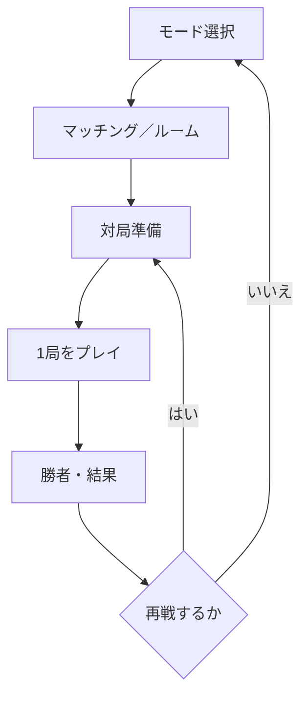
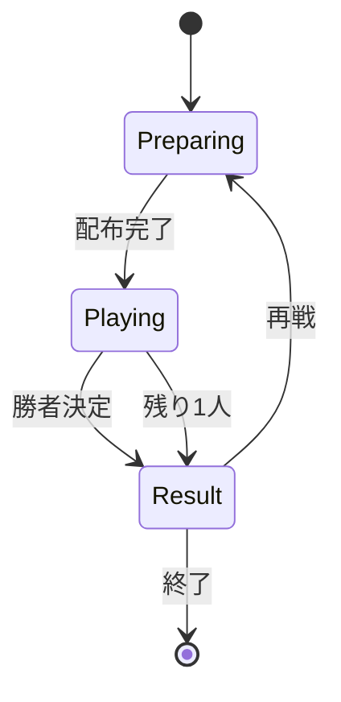

# 独自カードゲーム 要件定義書

- 文書ID：GAME-RD-001
- 版数：0.3
- 文書状態：v1.0開発基準
- 作成日：2026-08-27
- 対象：Android先行v1.0（CPU戦＋フレンド対戦）を中心とした製品要件
- 関連文書：`独自カードゲーム_用語集と要件定義目次.md`、`独自カードゲーム_横断マイルストーン_TODO_v0.2.md`、`独自カードゲーム_M0～M8_詳細TODO_v0.2.md`

## 0. 文書管理

### 0.1 目的

本書は、独自ルールを持つ対戦カードゲームをスマートフォン向けアプリとして開発するために、ゲームルール、機能、データ、オンライン対戦、運用および非機能要件を定義する。

本書は企画、画面設計、ルールエンジン設計、データベース設計、テスト設計および見積りの共通基準として使用する。

### 0.2 要件の状態

| 状態 | 意味 |
|---|---|
| 確定 | 本対話で内容が合意済み。変更時は変更履歴を残す。 |
| 一部未決 | 方向性は確定しているが、実現方法や一部の条件が未決。 |
| 提案 | 本書で推奨案を提示しているが、正式な合意が必要。 |
| 未決 | 選択肢や数値を今後決定する必要がある。 |
| 将来 | 初期リリースの対象外だが、将来対応を阻害しない構造が必要。 |

### 0.3 優先度

| 優先度 | 意味 |
|---|---|
| Must | 初期リリースの成立に必須。 |
| Should | 初期リリースに含めることが望ましい。 |
| Could | 工数と優先順位により採否を決める。 |

### 0.4 要件記述規則

- 各要件へ一意の要件IDを付与する。
- 表示名ではなく要件ID・用語ID・内部コードを参照する。
- 未決事項は本文内で推測して確定せず、第33章へ集約する。
- ルール要件には、少なくとも1つの正常例または不正例を受入条件として持たせる。
- 詳細設計で要件を変更せず、変更が必要な場合は本書を先に改訂する。

### 0.5 変更履歴

| 版数 | 日付 | 変更内容 |
|---|---|---|
| 0.1 | 2026-08-27 | 確定済みルールを要件定義本文へ初回展開。 |
| 0.2 | 2026-08-27 | v1.0範囲、Android対応、認証、招待、広告、非機能目標、退会処理を確定し、公式対戦を将来版へ移動。 |
| 0.3 | 2026-09-01 | 場のロック体系を再定義（枚数ロック新設、属性固定ロック新設、§10.1 属性ロックを属性統一ロックへ再定義）。§8.3 / §9.3 / §9.4 / §10.1 / §31.2 を改訂。M1-EX-10 のQAで発覚。 |

## 1. 背景・目的

### 1.1 開発背景

本製品は、大貧民を着想元としつつ、次の独自性を持つカードゲームである。

- 1～9の数字を世界観上の9階級へ対応させる。
- 火・水・風・土の4属性を使用する。
- 昼と夜の反転によって数字の強弱を切り替える。
- 複数プレイヤーが同数セットや連番セットを追加して成長させる。
- 属性ロック、追加封印、革命、Jokerにより場の状態を変化させる。
- 1局の勝者だけを決め、2位以下を決めない。

### 1.2 製品目的

| 要件ID | 要件 | 状態 | 優先度 |
|---|---|---|---|
| OBJ-001 | プレイヤーが短時間で独自ルールのカード対戦を楽しめること。 | 確定 | Must |
| OBJ-002 | v1.0でCPU戦と2～6人のフレンド対戦を提供すること。公式対戦は将来版とする。 | 確定 | Must |
| OBJ-003 | 昼夜反転、場の成長、スキル使用を視覚的に理解できること。 | 確定 | Must |
| OBJ-004 | 毎局終了後広告と報酬広告を主な収益源として運営可能であること。 | 確定 | Must |
| OBJ-005 | 個人開発で段階的に機能・カード・言語を追加できること。 | 確定 | Must |

### 1.3 成功指標

具体的なKPI値は未決とし、初期リリース前に次の指標へ目標値を設定する。

- チュートリアル完了率
- 初回対局完了率
- 1日・7日・30日継続率
- 1ユーザー当たりの対局数
- フレンド招待リンクからの参加完了率
- 通信切断率
- ルール不成立操作の発生率
- 広告表示回数、広告完了率、広告収益
- クラッシュのないセッション率（99.0%以上）
- フレンド対戦の月間可用性（99.0%以上）

## 2. スコープ

### 2.1 対象範囲

| 要件ID | 対象 | 状態 | 優先度 |
|---|---|---|---|
| SCP-001 | 数字カード36枚と初期スキルカード6枚を使用する対局。 | 確定 | Must |
| SCP-002 | 2～6人のCPU戦。 | 確定 | Must |
| SCP-003 | 2～6人のフレンド対戦。 | 確定 | Must |
| SCP-004 | 人間4人固定の公式ランダム対戦。 | 将来 | 将来 |
| SCP-005 | CPU戦とフレンド対戦を分離した対局数、勝利数、勝率の記録。 | 確定 | Must |
| SCP-006 | 公式勝利数に基づく順位表示。 | 将来 | 将来 |
| SCP-007 | 毎局終了後の全画面広告と、次回広告スキップ権を付与する報酬広告。 | 確定 | Must |
| SCP-008 | 日本語による画面・ルール説明。 | 確定 | Must |
| SCP-009 | Android 10以上のスマートフォン・タブレットにおける横画面固定表示。 | 確定 | Must |
| SCP-010 | 全世界配信、対象年齢13歳以上。提供言語は日本語のみ。 | 確定 | Must |

### 2.2 初期リリース対象外

| 要件ID | 対象外項目 | 状態 |
|---|---|---|
| SCP-FUT-001 | 英語表示の提供。多言語化可能な構造だけを初期版へ含める。 | 将来 |
| SCP-FUT-002 | カードオープンなど、初期6枚以外のスキルカード。 | 将来 |
| SCP-FUT-003 | シーズンランキング。 | 将来 |
| SCP-FUT-004 | 課金カードによる対戦上の優位性。導入する場合も公平性を別途審査する。 | 将来 |
| SCP-FUT-005 | 3D盤面、常時Live2D、リアルタイム3Dキャラクター。 | 将来 |
| SCP-FUT-006 | iOS版。Android版の安定後に対応時期を決定する。 | 将来 |
| SCP-FUT-007 | 人間4人固定の公式ランダム対戦、公式順位、カジュアル対戦。 | 将来 |

### 2.3 対応プラットフォーム

| 要件ID | 要件 | 状態 |
|---|---|---|
| PLT-001 | v1.0はAndroid 10以上を対象とする。 | 確定 |
| PLT-002 | Expo／React Native＋TypeScriptで実装する。 | 確定 |
| PLT-003 | Androidスマートフォンとタブレットを正式対応し、対局画面は横画面固定とする。 | 確定 |
| PLT-004 | iOS版とWeb版はv1.0対象外とし、将来対応とする。 | 確定 |

## 3. 用語・多言語化

### 3.1 用語管理方針

用語の日本語名は将来変更できるものとし、ルール、データおよびプログラムは表示名へ依存させない。

| 要件ID | 要件 | 状態 | 優先度 |
|---|---|---|---|
| TERM-REQ-001 | 各主要用語に変更されない用語IDを付与すること。 | 確定 | Must |
| TERM-REQ-002 | 日本語名、英語名、内部コード、定義を分離して管理すること。 | 確定 | Must |
| TERM-REQ-003 | 用語の状態を仮称、確定、廃止のいずれかで管理すること。 | 確定 | Must |
| TERM-REQ-004 | 名称変更時に旧名称と変更履歴を保持できること。 | 確定 | Should |
| TERM-REQ-005 | DBの主キー、保存イベント、API値に日本語表示名を使用しないこと。 | 確定 | Must |

### 3.2 初期用語マスタ

英語名は暫定訳であり、英語版制作時にネイティブレビューを行う。

| 用語ID | 日本語名（仮称） | 英語名（暫定） | 内部コード |
|---|---|---|---|
| TERM-001 | 数字 | Rank | `RANK` |
| TERM-002 | 属性 | Element / Suit | `SUIT` |
| TERM-003 | 場 | Field | `FIELD` |
| TERM-004 | アクティブセット | Active Set | `ACTIVE_SET` |
| TERM-005 | 同数セット | Rank Set | `RANK_SET` |
| TERM-006 | 連番セット | Sequence | `SEQUENCE` |
| TERM-007 | 追加 | Extension | `EXTEND` |
| TERM-008 | 更新 | Replacement | `REPLACE` |
| TERM-009 | 場流し | Clear Field | `CLEAR_FIELD` |
| TERM-010 | 属性ロック | Suit Lock | `SUIT_LOCK` |
| TERM-011 | 追加封印 | Extension Seal | `EXTENSION_SEAL` |
| TERM-012 | 革命 | Revolution | `REVOLUTION` |
| TERM-013 | 自然革命 | Natural Revolution | `NATURAL_REVOLUTION` |
| TERM-014 | 変化Joker | Transform Joker | `TRANSFORM_JOKER` |
| TERM-015 | 上がり | Going Out | `GO_OUT` |
| TERM-016 | 1局 | Round | `ROUND` |

### 3.3 固定内部コード

| 分類 | 内部コード |
|---|---|
| 数字 | `RANK_1`～`RANK_9` |
| 属性 | `SUIT_FIRE`、`SUIT_WATER`、`SUIT_WIND`、`SUIT_EARTH` |
| スキル | `SKILL_JOKER_HERO`、`SKILL_JOKER_SAINT`、`SKILL_EXTENSION_SEAL`、`SKILL_REVOLUTION` |
| 昼夜 | `DAY`、`NIGHT` |
| 組み合わせ | `SINGLE`、`RANK_SET`、`SEQUENCE` |
| プレイ種別 | `LEAD`、`EXTEND`、`REPLACE`、`PASS`、`CLEAR_FIELD` |

### 3.4 多言語化要件

| 要件ID | 要件 | 状態 | 優先度 |
|---|---|---|---|
| I18N-001 | 初期リリースは日本語を提供言語とする。 | 確定 | Must |
| I18N-002 | 画面文言、カード名、説明文、エラー文を言語リソースとして外部化すること。 | 確定 | Must |
| I18N-003 | 言語リソースは安定したキーで参照し、表示文字列をプログラム条件に使用しないこと。 | 確定 | Must |
| I18N-004 | 将来、英語リソースを追加するだけで画面表示を切り替えられる構造とすること。 | 確定 | Must |
| I18N-005 | カード画像へ変更頻度の高い名称・説明を直接焼き込まないこと。 | 提案 | Should |
| I18N-006 | 英語表示で文字数が増えても主要ボタンとカード説明が欠けないレイアウトとすること。 | 提案 | Should |
| I18N-007 | 英語版公開前に用語、世界観、カード名の翻訳レビューを行うこと。 | 将来 | Must |

## 4. サービス概要

### 4.1 ゲーム構成



### 4.2 基本ゲームサイクル

1. 対戦モードを選択する。
2. 参加プレイヤーを確定する。
3. 数字カードとスキルカードをシャッフルして配る。
4. 昼から対局を開始する。
5. プレイヤーは手番ごとにカードを出すか、場がある場合はパスする。
6. 属性ロック、追加封印、革命およびJokerの効果を解決する。
7. 最初に数字カードを0枚にしたプレイヤーを勝者とする。
8. 結果とモード別統計を記録する。
9. 再戦またはモード選択へ戻る。

### 4.3 プレイヤー人数

| モード | 人数 | 構成 | 公式勝利数 |
|---|---:|---|---|
| CPU戦 | 2～6人 | 人間とCPU | 対象外 |
| フレンド対戦 | 2～6人 | 招待された人間。設定によりCPU引継ぎあり | 対象外 |
| 公式ランダム対戦（将来） | 4人固定 | 人間のみ | 対象 |

## 5. 利用者・ユースケース

### 5.1 利用者区分

| 利用者 | 概要 |
|---|---|
| プレイヤー | v1.0ではCPU戦とフレンド対戦を行い、結果や統計を確認する。 |
| ルーム作成者 | フレンド対戦のルーム設定と再戦進行を行う。退出時は最古参の残存参加者へ権限を移譲する。 |
| 運営管理者 | お知らせ、マスタ、違反対応、ログ調査などを行う。初期管理範囲は未決。 |

### 5.2 主要ユースケース

| UC-ID | ユースケース | 主な完了条件 | 状態 |
|---|---|---|---|
| UC-001 | CPU戦を開始する | 指定人数のCPUを含む対局が開始される。 | 確定 |
| UC-002 | フレンドルームを作成する | HTTPS招待リンクが発行され、2～6人で開始できる。 | 確定 |
| UC-003 | フレンドルームへ参加する | 招待リンクから入室でき、未導入時は案内ページからGoogle Playへ進める。 | 確定 |
| UC-004 | 公式対戦へ参加する | 人間4人が成立し、カードが配られる。 | 将来 |
| UC-005 | カードを出す | 合法なカードだけが場へ反映される。 | 確定 |
| UC-006 | パスする | 場がある場合に限り、手番が次へ進む。 | 確定 |
| UC-007 | スキルを使用する | スキル固有の順序で合法性と効果が処理される。 | 確定 |
| UC-008 | Jokerを使用する | 場流しまたは変化の選択に従って処理される。 | 確定 |
| UC-009 | 通信切断から復帰する | 60秒以内なら最新状態へ再同期し復帰する。 | 確定 |
| UC-010 | 対局結果を確認する | 勝者、勝利数、モード別統計が表示される。 | 確定 |
| UC-011 | 対局履歴を確認する | 公開済みの使用カードと行動を確認できる。 | 確定 |
| UC-012 | 公式順位を確認する | 公式勝利数による順位を確認できる。 | 将来 |

## 6. カード要件

### 6.1 数字カード

| 要件ID | 要件 | 状態 | 優先度 |
|---|---|---|---|
| CARD-001 | 数字カードは数字9種類×属性4種類の36枚とする。 | 確定 | Must |
| CARD-002 | 同じ数字・同じ属性を持つ実在カードは1枚だけとする。 | 確定 | Must |
| CARD-003 | 各カードは安定したカードIDを持つこと。 | 確定 | Must |
| CARD-004 | 表示名や画像を変更してもカードID、数字、属性を変更しないこと。 | 確定 | Must |

| 数字 | 内部コード | 日本語カード名（仮称） |
|---:|---|---|
| 1 | `RANK_1` | 大魔王 |
| 2 | `RANK_2` | 魔王 |
| 3 | `RANK_3` | 魔将軍 |
| 4 | `RANK_4` | 悪魔 |
| 5 | `RANK_5` | 人間の戦士 |
| 6 | `RANK_6` | 天使 |
| 7 | `RANK_7` | 聖将軍 |
| 8 | `RANK_8` | 大天使 |
| 9 | `RANK_9` | 神 |

### 6.2 スキルカード

| 要件ID | カード | 枚数 | 要件 | 状態 |
|---|---|---:|---|---|
| CARD-101 | 勇者Joker | 1 | 場流しまたは変化を選択できる。 | 確定 |
| CARD-102 | 聖女Joker | 1 | 場流しまたは変化を選択できる。 | 確定 |
| CARD-103 | 追加封印 | 2 | 同数字追加と連番拡張を禁止する。 | 確定 |
| CARD-104 | 革命 | 2 | 先に昼夜を反転し、反転後に数字カードを判定する。 | 確定 |

### 6.3 スキル共通要件

| 要件ID | 要件 | 状態 | 優先度 |
|---|---|---|---|
| SKILL-001 | 各プレイヤーへ対局開始時にスキルカードをランダムで1枚配ること。 | 確定 | Must |
| SKILL-002 | スキルカードを数字カードと別のスキル枠に保持すること。 | 確定 | Must |
| SKILL-003 | スキルカードは使い切りとし、対局中に追加ドローしないこと。 | 確定 | Must |
| SKILL-004 | 参加人数未満の余剰スキルカードを対局外とすること。 | 確定 | Must |
| SKILL-005 | 1手番に使用できるスキルカードを最大1枚とすること。 | 確定 | Must |
| SKILL-006 | Joker以外のスキルカードは数字カードと同時に使用すること。 | 確定 | Must |
| SKILL-007 | 未使用スキルが残っていても、数字カードが0枚なら上がりを認めること。 | 確定 | Must |
| SKILL-008 | 将来のスキルをマスタ追加でき、ルールエンジンへ効果種別を追加できる構造とすること。 | 確定 | Must |

## 7. 対局準備要件

### 7.1 数字カードの配布

36枚の数字カードを毎局シャッフルし、すべて配布する。

| 人数 | 配布枚数 |
|---:|---|
| 2人 | 18枚ずつ |
| 3人 | 12枚ずつ |
| 4人 | 9枚ずつ |
| 5人 | 1人が8枚、4人が7枚 |
| 6人 | 6枚ずつ |

| 要件ID | 要件 | 状態 |
|---|---|---|
| SETUP-001 | 数字カード36枚を重複・欠落なく配布すること。 | 確定 |
| SETUP-002 | 5人対戦では8枚を受け取る席を1席とすること。 | 確定 |
| SETUP-003 | 5人対戦の初局では8枚を受け取ったプレイヤーを先攻とすること。 | 確定 |
| SETUP-004 | 5人以外の初局では先攻をランダムに決めること。 | 確定 |
| SETUP-005 | 同じルームでの再戦では先攻を時計回りに交代すること。 | 確定 |
| SETUP-006 | 5人での再戦では8枚配布席も時計回りに交代すること。 | 確定 |
| SETUP-007 | 各局を昼の状態から開始すること。 | 確定 |
| SETUP-008 | 先攻でも合法なスキルカードを使用できること。 | 確定 |

### 7.2 配布の受入条件

- 4人公式対戦で、全員の数字カードが9枚になること。
- 同じカードIDが複数プレイヤーへ配布されないこと。
- 配布後の全手札に含まれるカードIDの集合が数字デッキ36枚と一致すること。
- 各プレイヤーのスキル枠が1枚になり、同じ物理スキルカードが重複配布されないこと。
- 対局中に他プレイヤーの手札内容やスキル種類がクライアントへ不要に公開されないこと。

## 8. 基本ゲームルール

### 8.1 手番で選択できる行動

| 場の状態 | 選択可能な行動 |
|---|---|
| 場が空 | 数字カードを出す、数字カード＋Joker以外のスキルを出す、変化Jokerを出す。パス不可。 |
| 場がある | 合法なカードを出す、スキルを使用する、パスする。 |

| 要件ID | 要件 | 状態 |
|---|---|---|
| TURN-001 | システムは現在の手番プレイヤー以外からのプレイ要求を受理しないこと。 | 確定 |
| TURN-002 | 場が空のとき、先頭プレイヤーにパスを許可しないこと。 | 確定 |
| TURN-003 | 数字カードまたは変化Jokerが合法に出されるたび、連続パス状態をリセットすること。 | 確定 |
| TURN-004 | 一度パスしたプレイヤーも、ほかのプレイヤーがカードを出した後に再び手番へ参加できること。 | 確定 |
| TURN-005 | プレイヤーは合法なカードを持っていても任意にパスできること。ただし場が空の場合を除く。 | 確定 |
| TURN-006 | 1回の操作要求を、カード、スキル、宣言内容を含む一つのプレイとして扱うこと。 | 確定 |

### 8.2 通常の場流し

| 要件ID | 要件 | 状態 |
|---|---|---|
| FLOW-001 | 最終出し手以外の全アクティブプレイヤーが、その後連続してパスした場合に場を流すこと。 | 確定 |
| FLOW-002 | 場を流した後、通常は最終出し手を次の先頭とすること。 | 確定 |
| FLOW-003 | 場流し時にアクティブセットを捨て札へ移動すること。 | 確定 |
| FLOW-004 | 場流し時に場のロック（枚数・属性固定・属性統一）、追加封印、アクティブセット上のJoker宣言を解除すること。 | 確定 |
| FLOW-005 | 場流し後も昼夜状態を維持すること。 | 確定 |
| FLOW-006 | 最終出し手が棄権済みの場合、手番順で次のアクティブプレイヤーを先頭とすること。 | 確定 |

### 8.3 場の追加と更新

| 用語 | 処理 |
|---|---|
| 追加 | 既存のアクティブセットを残したまま、同数字または連続数字を継ぎ足す。 |
| 更新 | 既存のアクティブセットを捨て札へ移し、より強い新しい組み合わせをアクティブセットにする。 |

| 要件ID | 要件 | 状態 |
|---|---|---|
| FIELD-001 | 追加時、既存カードと今回のカードを統合した結果を新しいアクティブセットとすること。 | 確定 |
| FIELD-002 | 更新時、更新前のカードを捨て札へ移すこと。 | 確定 |
| FIELD-003 | 更新前の変化Jokerを、宣言情報を履歴へ残したうえで捨て札へ移すこと。 | 確定 |
| FIELD-004 | 場のロック（枚数ロック・属性固定ロック・属性統一ロック）と追加封印を、場が更新されても維持すること。 | 確定 |
| FIELD-005 | 更新後は更新後の組み合わせだけを次の比較対象とすること。 | 確定 |
| FIELD-006 | アクティブセットが一度でも更新された場合、そのアクティブセットが場から流れるまで追加・拡張を認めず、更新直前と同じ枚数・同じ種別のより強い組み合わせによる更新だけを認めること（枚数ロック）。 | 確定 |

## 9. 組み合わせ・比較要件

### 9.1 組み合わせ種別

| 種別 | 枚数 | 条件 |
|---|---:|---|
| 単体 | 1枚 | 任意の数字カードまたは変化Joker1枚。 |
| 同数セット | 2～4枚 | 数字がすべて同じで、数字＋属性の完全重複がない。 |
| 連番セット | 3～9枚 | 数字がすべて異なり、1ずつ連続している。1と9は循環しない。 |

| 要件ID | 要件 | 状態 |
|---|---|---|
| COMBO-001 | 場が空のとき、単体、同数セットまたは連番セットを自由にリードできること。 | 確定 |
| COMBO-002 | 2枚だけの連番を認めないこと。 | 確定 |
| COMBO-003 | `891`など数字9から1へ循環する連番を認めないこと。 | 確定 |
| COMBO-004 | `223344`など同じ数字を複数含む連番を認めないこと。 | 確定 |
| COMBO-005 | 属性ロックがない場合、連番セットの属性は混在できること。 | 確定 |
| COMBO-006 | 同数セットの最大枚数を4枚とし、Jokerを含めても5枚以上を認めないこと。 | 確定 |
| COMBO-007 | 連番セットの最大枚数を9枚とすること。 | 確定 |

### 9.2 昼夜の強弱

| 状態 | 弱い → 強い |
|---|---|
| 昼 | 1 → 2 → 3 → 4 → 5 → 6 → 7 → 8 → 9 |
| 夜 | 9 → 8 → 7 → 6 → 5 → 4 → 3 → 2 → 1 |

| 要件ID | 要件 | 状態 |
|---|---|---|
| STRENGTH-001 | 昼は数字が大きい組み合わせを強いと判定すること。 | 確定 |
| STRENGTH-002 | 夜は数字が小さい組み合わせを強いと判定すること。 | 確定 |
| STRENGTH-003 | 昼夜反転後も数字カード自体の数字と属性を変更しないこと。 | 確定 |
| STRENGTH-004 | 昼夜が反転しても手番順を反転しないこと。 | 確定 |

### 9.3 単体・同数セットへの応答

| 要件ID | 要件 | 状態 |
|---|---|---|
| SINGLE-001 | 現在が単体の場合、同じ数字のカードを1枚以上追加して同数セットへ成長させられること。 | 確定 |
| SINGLE-002 | 現在が単体の場合、現在の昼夜でより強い単体へ更新できること。 | 確定 |
| SINGLE-003 | 現在が単体の場合、異なる数字の2枚以上を出して更新できないこと。 | 確定 |
| RANKSET-001 | 現在のアクティブセットが更新されていない場合に限り、現在と同じ数字のカードを1枚以上まとめて追加できること。 | 確定 |
| RANKSET-002 | 追加後の合計枚数が4枚を超えないこと。 | 確定 |
| RANKSET-003 | 場を更新する場合、現在と同じ枚数の同数セットを出すこと。 | 確定 |
| RANKSET-004 | 更新する同数セットは、現在の昼夜でより強い数字であること。 | 確定 |
| RANKSET-005 | 追加後は、追加後の枚数を次回更新時の必要枚数とすること。 | 確定 |
| RANKSET-006 | 同数セットに対して連番セットで更新できないこと。 | 確定 |
| RANKSET-007 | 現在のアクティブセットが更新されている場合、追加を認めず、同じ枚数のより強い同数セットによる更新だけを認めること。 | 確定 |
| RANKSET-008 | 初回更新で出したカードの属性の組が、置き換えるセットの属性の組と多重集合として一致した場合、以降の更新は属性の組が一致すること（属性固定ロック）。初回更新で不一致なら属性固定ロックは発生しないこと。 | 確定 |

#### 受入例

| 状態 | 場 | プレイ | 判定 |
|---|---|---|---|
| 昼 | `6` | `6・6`を追加 | 合法。場は`666`。 |
| 昼 | `66` | `77` | 合法。より強い2枚組へ更新。 |
| 昼 | `66` | `55` | 不正。昼では弱い。 |
| 夜 | `66` | `55` | 合法。夜では5が6より強い。 |
| 夜 | `666` | `55` | 不正。枚数が一致しない。 |
| 昼 | `6666` | Jokerを5枚目の6として追加 | 不正。同数セットは最大4枚。 |
| 昼 | リード`炎5` → 追加`水5` | （まだ更新なし） | ロック未発動。追加は可能。 |
| 昼 | リード`炎5` → 追加`水5` → 更新`炎6水6` | 単体`8`を追加 | 不正。2枚ロック（枚数ロック）。 |
| 昼 | リード`炎7水7` → 更新`炎8水8` | — | 属性一致 → `{炎,水}`固定。以降の更新は属性の組が一致すること。 |
| 昼 | `{炎,水}`固定の場`炎8水8` | `炎9炎9`で更新（Joker併用時） | 不正。`{炎,炎}` ≠ `{炎,水}`（属性固定ロック）。 |
| 昼 | リード`炎5` → 更新`水6` | — | 不一致 → 属性固定ロックなし（枚数ロックのみ）。 |
| 昼 | 上記の続き（属性固定なし）`水6` | `水7`で更新 → `炎8`で更新 | いずれも属性は自由（初回更新でしか判定しない）。 |

### 9.4 連番セットへの応答

| 要件ID | 要件 | 状態 |
|---|---|---|
| SEQ-001 | 場を更新する場合、現在と同じ枚数の連番セットを出すこと。 | 確定 |
| SEQ-002 | 昼は、現在より開始数字および終了数字が大きい連番を強いと判定すること。 | 確定 |
| SEQ-003 | 夜は、現在より開始数字および終了数字が小さい連番を強いと判定すること。 | 確定 |
| SEQ-004 | 現在のアクティブセットが更新されていない場合に限り、昼は現在の連番の大きい数字側へ、連続する1枚以上を追加できること。 | 確定 |
| SEQ-005 | 現在のアクティブセットが更新されていない場合に限り、夜は現在の連番の小さい数字側へ、連続する1枚以上を追加できること。 | 確定 |
| SEQ-006 | 追加カードの途中で数字を飛ばさないこと。 | 確定 |
| SEQ-007 | 拡張後は、拡張後の枚数を次回更新時の必要枚数とすること。 | 確定 |
| SEQ-008 | 連番セットに対して同数セットで更新できないこと。 | 確定 |
| SEQ-009 | 現在の連番セットが更新されている場合、拡張を認めず、同じ枚数のより強い連番セットによる更新だけを認めること（枚数ロック）。 | 確定 |
| SEQ-010 | 初回更新で出したカードの属性の組が、置き換えるセットの属性の組と多重集合として一致した場合、以降の更新は属性の組が一致すること（属性固定ロック）。初回更新で不一致なら属性固定ロックは発生しないこと。 | 確定 |

#### 受入例

| 状態 | 場 | プレイ | 判定 |
|---|---|---|---|
| 昼 | `234` | `56`を追加 | 合法。場は`23456`。 |
| 昼 | `234` | `6`を追加 | 不正。5を飛ばしている。 |
| 昼 | `234` | `345` | 合法。同じ3枚でより強い。 |
| 夜 | `567` | `34`を追加 | 合法。場は`34567`。 |
| 夜 | `567` | `678` | 不正。夜では弱い。 |
| 昼 | `23456` | `345` | 不正。枚数が一致しない。 |
| 昼 | リード`炎3炎4炎5` → 追加`炎6` → 更新`水4水5水6水7` | 単体を追加 | 不正。4枚連番ロック（枚数ロック）。 |
| 昼 | 混色連番`水5風6土7` → 更新`炎6炎7炎8` | — | `{炎,炎,炎}` ≠ `{水,風,土}` → 属性固定なし（枚数ロック3連番のみ）。 |
| 昼 | リード`炎3炎4炎5` → 追加`炎6` → 更新`炎4炎5炎6炎7` | — | 成長後`{炎×4}`と一致 → `{炎×4}`固定。 |
| 昼 | リード`炎3炎4炎5`（同属性連番） | `水6`を追加 | 不正。属性統一が崩れる（属性統一ロック）。 |
| 昼 | リード`炎3炎4炎5`（同属性連番） | `水4水5水6`で更新 | 合法。統一された連番なら属性は変更可。 |
| 昼 | リード`炎3炎4炎5`（同属性連番） | `水4炎5風6`で更新 | 不正。更新セットが同一属性でない。 |
| 昼 | 混色連番`炎3水4風5`をリード | — | 属性統一ロックなし。追加は属性混在可（SEQ範囲内）。 |

### 9.5 完全重複

| 要件ID | 要件 | 状態 |
|---|---|---|
| DUP-001 | 同じアクティブセット内で数字＋属性が完全に同じカードを複数認めないこと。 | 確定 |
| DUP-002 | 実在カードと変化Jokerの間にも完全重複判定を適用すること。 | 確定 |
| DUP-003 | 2枚の変化Joker間にも完全重複判定を適用すること。 | 確定 |

## 10. 属性ロック・追加封印要件

### 10.1 属性ロック（属性統一ロック / 属性固定ロック）

「属性ロック」は、リード時に発生する**属性統一ロック**と、初回更新時に発生する**属性固定ロック**の総称とする。枚数ロック（§8.3 FIELD-006、§9.3 RANKSET-007、§9.4 SEQ-009）と合わせて3種類の「場のロック」を構成し、いずれもその場が流れた時点で解除される。

| 要件ID | 要件 | 状態 |
|---|---|---|
| LOCK-001 | リードが連番セットで全カードが同一属性の場合、属性統一ロックを発生させること。以降、その場が流れるまで、追加は同一属性を維持すること、更新は全カード同一属性の連番セットであること（属性は変更可）。 | 確定 |
| LOCK-002 | 属性を宣言した変化Jokerを、属性統一ロック・属性固定ロックの判定へ含めること。 | 確定 |
| LOCK-003 | 属性統一ロック中、アクティブセットの同一属性が崩れる追加・更新を不正とすること。 | 確定 |
| LOCK-004 | 枚数ロック・属性固定ロック・属性統一ロックを、その場が更新されても継続すること。 | 確定 |
| LOCK-005 | 通常またはJokerによる場流しで、枚数ロック・属性固定ロック・属性統一ロックをすべて解除すること。 | 確定 |
| LOCK-006 | 属性固定ロックは §9.3 RANKSET-008 / §9.4 SEQ-010 に従い、初回更新時にのみ判定すること。 | 確定 |

#### 受入例

属性統一ロック（リード由来）:

| 状態 | 局面 | プレイ | 判定 |
|---|---|---|---|
| 昼 | リード`炎3炎4炎5`（同属性連番） | `炎6`を追加 | 合法。場は`炎3炎4炎5炎6`。 |
| 昼 | 同上 | `水6`を追加 | 不正。属性統一が崩れる。 |
| 昼 | 同上 | `水4水5水6`で更新 | 合法。統一された連番なら属性は変更可。 |
| 昼 | 同上 | `水4炎5風6`で更新 | 不正。更新セットが同一属性でない。 |
| 昼 | 混色連番`炎3水4風5`をリード | — | 属性統一ロックなし。追加は属性混在可（SEQ範囲内）。 |

属性固定ロック（初回更新由来）:

| 状態 | 局面 | プレイ | 判定 |
|---|---|---|---|
| 昼 | リード`炎5` → 更新`炎6` | — | 属性一致 → `{炎}`固定。以降は炎単体の更新のみ。 |
| 昼 | `{炎}`固定の場`炎6` | `水7`で更新 | 不正。属性の組不一致。 |
| 昼 | リード`炎7水7` → 更新`炎8水8` | — | 属性一致 → `{炎,水}`固定。 |
| 昼 | リード`炎5` → 更新`水6` | — | 不一致 → 属性固定ロックなし（枚数ロックのみ）。 |
| 昼 | 上記の続き（属性固定なし） | `水7`で更新 → `炎8`で更新 | いずれも属性は自由（初回更新でしか判定しない）。 |
| 昼 | リード`炎3炎4炎5` → 追加`炎6` → 更新`炎4炎5炎6炎7` | — | 成長後`{炎×4}`と一致 → `{炎×4}`固定。 |

3ロックは独立に同時成立し得る。例: 同属性連番リードで属性統一ロック → 同属性で初回更新すると、その更新で枚数ロック・属性固定ロックも発生し、3つすべて有効。

### 10.2 追加封印

| 要件ID | 要件 | 状態 |
|---|---|---|
| SEAL-001 | 追加封印カードを、Joker以外のスキルとして数字カードと同時に使用すること。 | 確定 |
| SEAL-002 | 今回の数字カードを合法に場へ反映した後、追加封印を有効にすること。 | 確定 |
| SEAL-003 | 追加封印中、同数字追加を禁止すること。 | 確定 |
| SEAL-004 | 追加封印中、連番拡張を禁止すること。 | 確定 |
| SEAL-005 | 追加封印中も、同じ種類・同じ枚数のより強い組み合わせによる更新を認めること。 | 確定 |
| SEAL-006 | 追加封印を場の更新後も継続すること。 | 確定 |
| SEAL-007 | 通常またはJokerによる場流しで追加封印を解除すること。 | 確定 |
| SEAL-008 | 最後の数字カードと追加封印カードを同時に使用した上がりを認めること。 | 確定 |

#### 受入例

| 場 | 効果 | プレイ | 判定 |
|---|---|---|---|
| 昼の`66` | 追加封印 | `6`を追加 | 不正。 |
| 昼の`66` | 追加封印 | `77` | 合法。更新は可能。 |
| 昼の`66` | 火属性ロック＋追加封印 | 火属性だけで構成した強い同枚数セット | 条件をすべて満たせば合法。 |

### 10.3 効果の共存

| 要件ID | 要件 | 状態 |
|---|---|---|
| EFFECT-001 | 属性ロックと追加封印が同時に有効になることを認めること。 | 確定 |
| EFFECT-002 | 複数の場の効果が有効な場合、すべての条件を満たすプレイだけを合法とすること。 | 確定 |
| EFFECT-003 | UIは現在有効な属性ロックと追加封印を別々に表示すること。 | 確定 |

## 11. 革命・昼夜要件

### 11.1 自然革命

| 要件ID | 要件 | 状態 |
|---|---|---|
| REV-001 | 場が空のとき、新しく4枚以上の同数セットまたは連番セットを出すと自然革命を発生させること。 | 確定 |
| REV-002 | 3枚以下のアクティブセットへ追加し、結果が4枚以上になったとき自然革命を1回発生させること。 | 確定 |
| REV-003 | 新しい4枚以上の組み合わせで場を更新したとき再び自然革命を発生させること。 | 確定 |
| REV-004 | すでに4枚以上の連番セットへ追加しただけの場合、自然革命を再発生させないこと。 | 確定 |
| REV-005 | 1回のプレイで複数枚を追加しても、そのプレイによる自然革命を最大1回とすること。 | 確定 |
| REV-006 | 数字カードの合法性を革命前の昼夜で判定し、場へ反映した後に自然革命を適用すること。 | 確定 |
| REV-007 | 自然革命後、次のプレイヤーから反転後の強弱と拡張方向を適用すること。 | 確定 |

### 11.2 革命カード

| 要件ID | 要件 | 状態 |
|---|---|---|
| REVSKILL-001 | 革命カードを数字カードと同時に使用すること。 | 確定 |
| REVSKILL-002 | 数字カードの合法性を判定する前に昼夜を反転すること。 | 確定 |
| REVSKILL-003 | 反転後の強弱、連番拡張方向、場のロック、追加封印を使ってプレイを判定すること。 | 確定 |
| REVSKILL-004 | 反転後にプレイが不正なら、昼夜反転を取り消し、カードを消費しないこと。 | 確定 |
| REVSKILL-005 | 自然革命が発生するプレイと革命カードの併用を禁止すること。 | 確定 |
| REVSKILL-006 | 最後の数字カードと革命カードを同時に使用した上がりを認めること。 | 確定 |

#### 受入例

```text
現在：昼、場は77
プレイ：革命カード＋66
処理：先に夜へ反転 → 夜では66が77より強い → 合法
```

```text
現在：昼、場は567
プレイ：革命カード＋34を追加
処理：先に夜へ反転 → 夜では小さい側への拡張 → 34567
```

### 11.3 昼夜状態の保持

| 要件ID | 要件 | 状態 |
|---|---|---|
| DAYNIGHT-001 | 通常の場流しおよびJokerによる場流し後も昼夜状態を維持すること。 | 確定 |
| DAYNIGHT-002 | 1局が終了し、次の局を開始するとき昼へ戻すこと。 | 確定 |
| DAYNIGHT-003 | UIに現在の昼夜と強弱順を常時表示すること。 | 確定 |

## 12. Joker要件

### 12.1 共通要件

| 要件ID | 要件 | 状態 |
|---|---|---|
| JOKER-001 | 勇者Jokerと聖女Jokerは、初期版では同じルール上の効果を持つこと。 | 確定 |
| JOKER-002 | Joker使用時に、場流しまたは変化を選択できること。 | 確定 |
| JOKER-003 | Jokerの使用を、その手番のスキルカード1枚として数えること。 | 確定 |

### 12.2 場流しJoker

| 要件ID | 要件 | 状態 |
|---|---|---|
| JCLR-001 | 場が存在するときだけ、Jokerを場流し目的で使用できること。 | 確定 |
| JCLR-002 | 場が空のとき、場流しJokerを選択できないこと。 | 確定 |
| JCLR-003 | 使用したJokerを消費済みスキルへ移し、アクティブセットを捨て札へ移すこと。 | 確定 |
| JCLR-004 | 場のロック（枚数・属性固定・属性統一）と追加封印を解除すること。 | 確定 |
| JCLR-005 | 昼夜状態を維持すること。 | 確定 |
| JCLR-006 | 使用者が同じ手番内で続けて新しい場を作ること。 | 確定 |
| JCLR-007 | 続けて行うプレイでパスを認めないこと。 | 確定 |
| JCLR-008 | 続けて行うプレイで2枚目のスキルカードを使用できないこと。 | 確定 |
| JCLR-009 | 続けて最後の数字カードを出した場合の上がりを認めること。 | 確定 |

### 12.3 変化Joker

| 要件ID | 要件 | 状態 |
|---|---|---|
| JTR-001 | 変化Joker使用時に数字1～9と属性1種類を宣言させること。 | 確定 |
| JTR-002 | 変化Jokerを単体、同数セットまたは連番セットの一部として使用できること。 | 確定 |
| JTR-003 | 宣言した数字と属性を場が流れるまで固定すること。 | 確定 |
| JTR-004 | 宣言内容をカード上または隣接表示で全員へ示すこと。 | 確定 |
| JTR-005 | 変化Jokerを枚数、強弱、追加、更新、属性ロック、自然革命の判定へ含めること。 | 確定 |
| JTR-006 | 実在カードまたは別のJokerとの完全重複を禁止すること。 | 確定 |
| JTR-007 | 勇者Jokerと聖女Jokerを同じアクティブセットへ含めることを認めること。 | 確定 |
| JTR-008 | 2枚のJokerは互いに異なる数字＋属性を宣言すること。 | 確定 |
| JTR-009 | 最後の数字カードと変化Jokerを組み合わせた上がりを禁止すること。 | 確定 |
| JTR-010 | 禁止された変化Joker上がりを選択した場合、操作を確定できず、カードを消費しないこと。 | 確定 |

#### 受入例

```text
🔥3・🔥4
＋勇者Joker（🔥5）
＋聖女Joker（🔥6）
＝🔥3・🔥4・🔥5・🔥6

結果：火属性ロック＋4枚連番による自然革命
```

## 13. 効果処理・状態遷移要件

### 13.1 通常プレイの処理順

| 順序 | 処理 | 不成立時 |
|---:|---|---|
| 1 | 数字カードと使用するスキルカードを選択する。 | 操作を継続。 |
| 2 | 変化Jokerなら数字と属性を宣言する。 | 確定不可。 |
| 3 | 革命カードなら仮に昼夜を反転する。 | 後続不成立時に戻す。 |
| 4 | プレイ全体の合法性を判定する。 | 全変更を取り消す。 |
| 5 | 数字カードまたは変化Jokerを場へ追加・更新する。 | 全変更を取り消す。 |
| 6 | 追加封印カードを適用する。 | 全変更を取り消す。 |
| 7 | 反映後の場全体で場のロック（枚数・属性固定・属性統一）を判定・更新する。 | 全変更を取り消す。 |
| 8 | 条件を満たした場合に自然革命を適用する。 | 全変更を取り消す。 |
| 9 | 数字カードが0枚かを判定し、勝者を決定する。 | 次の手番へ進む。 |

### 13.2 トランザクション要件

| 要件ID | 要件 | 状態 | 優先度 |
|---|---|---|---|
| TX-001 | 1回のプレイを不可分な処理として実行すること。 | 確定 | Must |
| TX-002 | 途中で不成立になった場合、カード移動、スキル消費、昼夜、場の効果、手番をすべて元へ戻すこと。 | 確定 | Must |
| TX-003 | 同じプレイ要求を重複受信しても1回だけ処理すること。 | 提案 | Must |
| TX-004 | 成立したプレイに一意の行動IDと通し番号を付けること。 | 提案 | Must |
| TX-005 | 成立後の状態を全参加者へ同じ順序で配信すること。 | 提案 | Must |
| TX-006 | クライアント表示よりサーバー上の判定結果を正とすること。 | 提案 | Must |

### 13.3 対局状態遷移



### 13.4 プレイ判定の受入条件

- 不正操作では、操作前後のサーバー状態が完全に一致すること。
- 革命カードを含む不正操作で、昼夜だけが反転したまま残らないこと。
- 同じリクエストを再送してもカードが二重に消費されないこと。
- すべての端末で、同じ行動番号に対して同じアクティブセット、昼夜、手番、効果状態が表示されること。

## 14. 勝利・終了・再戦要件

### 14.1 上がり判定

| 要件ID | 要件 | 状態 |
|---|---|---|
| WIN-001 | 合法なプレイのすべての効果を処理した後、数字カードが0枚なら上がりとすること。 | 確定 |
| WIN-002 | スキル枠に未使用カードが残っていても上がりを認めること。 | 確定 |
| WIN-003 | 最後の数字カードだけでの上がりを認めること。 | 確定 |
| WIN-004 | 最後の数字カード＋追加封印カードでの上がりを認めること。 | 確定 |
| WIN-005 | 最後の数字カード＋革命カードでの上がりを認めること。 | 確定 |
| WIN-006 | 最後の数字カードで自然革命を発生させる上がりを認めること。 | 確定 |
| WIN-007 | 場流しJoker後、続けて最後の数字カードを出す上がりを認めること。 | 確定 |
| WIN-008 | 最後の数字カード＋変化Jokerでの上がりを禁止すること。 | 確定 |

### 14.2 勝者決定と終了

| 要件ID | 要件 | 状態 |
|---|---|---|
| WIN-101 | 最初に上がったプレイヤー1人を勝者とすること。 | 確定 |
| WIN-102 | 勝者決定後、その局を直ちに終了すること。 | 確定 |
| WIN-103 | 2位以下を決定しないこと。 | 確定 |
| WIN-104 | 勝者の対象モード勝利数を1増やすこと。 | 確定 |
| WIN-105 | 未使用スキルの種類を対局終了時にも相手へ公開しないこと。 | 確定 |
| WIN-106 | 再戦時に全カードを回収し、再シャッフル・再配布すること。 | 確定 |
| WIN-107 | 再戦時に昼へ戻し、場のロック、追加封印、Joker宣言、パス状態を初期化すること。 | 確定 |

### 14.3 上がり受入表

| 最後の出し方 | 判定 |
|---|---|
| 最後の数字カード6 | 勝利 |
| 最後の数字カード6＋追加封印 | 勝利 |
| 最後の数字カード6＋革命カード | 反転後に合法なら勝利 |
| 最後の数字カードを含む4枚組 | 自然革命後に勝利 |
| 場流しJoker→最後の数字カード6 | 勝利 |
| 最後の数字カード＋変化Joker | 不正。カードを消費しない |

## 15. 対戦モード要件

### 15.1 CPU戦

| 要件ID | 要件 | 状態 | 優先度 |
|---|---|---|---|
| MODE-CPU-001 | 合計2～6人でCPU戦を開始できること。 | 確定 | Must |
| MODE-CPU-002 | CPU戦の対局数、勝利数、勝率を専用統計として記録すること。 | 確定 | Must |
| MODE-CPU-003 | CPU戦の勝利を公式勝利数へ加算しないこと。 | 確定 | Must |
| MODE-CPU-004 | 通信対戦が利用できない場合でもCPU戦を開始できるかは、実装方式を踏まえて決定すること。 | 未決 | Could |

### 15.2 フレンド対戦

| 要件ID | 要件 | 状態 | 優先度 |
|---|---|---|---|
| MODE-FRIEND-001 | 合計2～6人でフレンド対戦を開始できること。 | 確定 | Must |
| MODE-FRIEND-002 | フレンド対戦の勝利数をルーム内に表示すること。 | 確定 | Must |
| MODE-FRIEND-003 | フレンド対戦の対局数、勝利数、勝率を公式統計と分けること。 | 確定 | Must |
| MODE-FRIEND-004 | フレンド対戦の勝利を公式勝利数へ加算しないこと。 | 確定 | Must |
| MODE-FRIEND-005 | 手番時間を15秒、30秒、60秒、無制限から選択できること。 | 確定 | Should |
| MODE-FRIEND-006 | 棄権した席をCPUへ引き継ぐ設定を選択できること。 | 確定 | Should |
| MODE-FRIEND-007 | HTTPS招待リンクでルームへ参加できること。アプリ未導入時は案内ページからGoogle Playへ誘導すること。 | 確定 | Must |

### 15.3 公式ランダム対戦（将来版）

| 要件ID | 要件 | 状態 | 優先度 |
|---|---|---|---|
| MODE-OFFICIAL-001 | 人間4人固定で対戦すること。 | 確定 | Must |
| MODE-OFFICIAL-002 | 対局開始時にCPUで不足人数を補わないこと。 | 確定 | Must |
| MODE-OFFICIAL-003 | 勝者へ公式勝利数を1加算すること。 | 確定 | Must |
| MODE-OFFICIAL-004 | 公式対戦の手番時間を30秒とすること。 | 確定 | Must |
| MODE-OFFICIAL-005 | マッチングが長引いた場合、待機継続またはカジュアル対戦への変更を案内すること。 | 確定 | Should |
| MODE-OFFICIAL-006 | 公式対戦でカード配布後に発生した棄権があっても、残存プレイヤーの公式勝利を有効とすること。 | 確定 | Must |

### 15.4 カジュアル対戦

カジュアル対戦はv1.0対象外とする。公式対戦を実装する将来版で、人数、CPU補充、統計記録を再検討する。

## 16. マッチング・ルーム要件

### 16.1 公式マッチング（将来版）

| 要件ID | 要件 | 状態 | 優先度 |
|---|---|---|---|
| MATCH-001 | プレイヤーが公式マッチングの開始と取消を操作できること。 | 提案 | Must |
| MATCH-002 | 人間4人の参加確定後にだけ対局準備へ進むこと。 | 確定 | Must |
| MATCH-003 | 同一プレイヤーを同じ対局へ重複参加させないこと。 | 提案 | Must |
| MATCH-004 | マッチング成立後の不参加・切断を記録できること。 | 提案 | Must |
| MATCH-005 | 待機時間の表示と長時間待機時の選択肢を提供すること。 | 確定 | Should |
| MATCH-006 | マッチング範囲、地域、レーティング条件は利用状況を踏まえて決定すること。 | 未決 | Should |

### 16.2 フレンドルーム

| 要件ID | 要件 | 状態 | 優先度 |
|---|---|---|---|
| ROOM-001 | ルーム作成者が参加人数と手番時間を設定できること。 | 提案 | Must |
| ROOM-002 | 対局開始前に参加者と設定を全員へ表示すること。 | 提案 | Must |
| ROOM-003 | 対局中に人数・手番時間を変更できないこと。 | 提案 | Must |
| ROOM-004 | 1局終了後に再戦意思を確認できること。 | 提案 | Must |
| ROOM-005 | 再戦時にルーム内勝利数を維持すること。 | 確定 | Must |
| ROOM-006 | ルームを離れた後にルーム内勝利数を保持する期間は別途決定すること。 | 未決 | Could |
| ROOM-007 | ルーム作成者が退出した場合、最も早く参加した残存プレイヤーへ作成者権限を移譲すること。 | 確定 | Must |
| ROOM-008 | 招待リンクはAndroid App Linksで処理し、案内ページはSupabase中心で構築すること。 | 確定 | Must |

## 17. 公開・非公開情報要件

### 17.1 数字カード

| 要件ID | 要件 | 状態 |
|---|---|---|
| VIS-001 | 自分の数字カードの内容を本人へ表示すること。 | 確定 |
| VIS-002 | 相手の数字カードの内容を非公開にすること。 | 確定 |
| VIS-003 | 全プレイヤーの数字カード残り枚数を公開すること。 | 確定 |
| VIS-004 | 場へ出された数字カードと変化Jokerの宣言内容を公開すること。 | 確定 |
| VIS-005 | 場が流れた後も使用済みカードを対局履歴から確認できること。 | 確定 |

### 17.2 スキルカード

| 要件ID | 要件 | 状態 |
|---|---|---|
| VIS-101 | 配布されたスキルの種類を所有者だけへ表示すること。 | 確定 |
| VIS-102 | 相手が未使用スキルを1枚保有していることだけを公開すること。 | 確定 |
| VIS-103 | スキル使用時に種類と効果を全員へ公開すること。 | 確定 |
| VIS-104 | 使用済みスキルを対局履歴から確認できること。 | 確定 |
| VIS-105 | 未使用のまま局が終了したスキル種類を相手へ公開しないこと。 | 確定 |
| VIS-106 | 将来の公開効果が、対象、公開情報、公開期間を指定して基本公開ルールを上書きできる構造とすること。 | 確定 |

### 17.3 情報保護

| 要件ID | 要件 | 状態 |
|---|---|---|
| VIS-201 | クライアントへ、そのプレイヤーが閲覧権限を持たない手札・スキル情報を送信しないこと。 | 提案 |
| VIS-202 | 対局履歴では、行動時点で公開された情報だけを表示すること。 | 提案 |
| VIS-203 | 運営調査用の完全ログと、プレイヤー向け公開履歴を分離すること。 | 提案 |

## 18. 制限時間・自動操作要件

### 18.1 公式対戦

| 要件ID | 要件 | 状態 |
|---|---|---|
| TIMER-001 | 各手番の制限時間を30秒とすること。 | 確定 |
| TIMER-002 | カード演出が終わり、操作可能になった時点から計測すること。 | 確定 |
| TIMER-003 | 残り10秒で視覚的な警告を表示すること。 | 確定 |
| TIMER-004 | 変化Jokerの数字・属性選択を同じ30秒に含めること。 | 確定 |
| TIMER-005 | 場流しJoker後の新しい場作成には、改めて30秒を付与すること。 | 確定 |
| TIMER-006 | 不正なカード選択中も計測を継続すること。 | 提案 |
| TIMER-007 | サーバー上の期限を正とし、端末時計へ依存しないこと。 | 提案 |

### 18.2 時間切れ処理

| 要件ID | 要件 | 状態 |
|---|---|---|
| TIMEOUT-001 | 場がある状態で時間切れになった場合、自動パスすること。 | 確定 |
| TIMEOUT-002 | 場が空の状態で時間切れになった場合、現在の昼夜で最も弱い数字カード1枚を自動提出すること。 | 確定 |
| TIMEOUT-003 | 自動提出でスキルカードを使用しないこと。 | 確定 |
| TIMEOUT-004 | 同じ最弱数字を複数属性所持する場合、サーバー側の乱数で1枚を選び、選択結果を対局イベントへ記録すること。 | 確定 |
| TIMEOUT-005 | 時間切れ回数をプレイヤーごとに連続回数として記録すること。 | 確定 |
| TIMEOUT-006 | 正常な手動操作が完了した場合、連続時間切れ回数を0へ戻すこと。 | 確定 |

## 19. 通信切断・棄権要件

### 19.1 通信切断と再接続

| 要件ID | 要件 | 状態 |
|---|---|---|
| CONN-001 | 通信切断を検知した後、60秒間を再接続猶予とすること。 | 確定 |
| CONN-002 | 再接続猶予中も対局を停止しないこと。 | 確定 |
| CONN-003 | 切断中に手番が来た場合、通常の時間切れ処理を適用すること。 | 確定 |
| CONN-004 | 60秒以内に復帰した場合、最新の対局状態へ同期して操作を再開できること。 | 確定 |
| CONN-005 | 再接続時に非公開情報を本人へ復元し、他人へ漏らさないこと。 | 提案 |

### 19.2 棄権

| 要件ID | 要件 | 状態 |
|---|---|---|
| FORFEIT-001 | 通信切断が60秒を超えた場合、棄権とすること。 | 確定 |
| FORFEIT-002 | 退出操作を行った場合、棄権とすること。 | 確定 |
| FORFEIT-003 | 3回連続で時間切れになった場合、棄権とすること。 | 確定 |
| FORFEIT-004 | 棄権者の残り数字カードと未使用スキルを対局から除外すること。 | 確定 |
| FORFEIT-005 | 棄権前に場へ出したカードを、通常どおり場が流れるまで有効とすること。 | 確定 |
| FORFEIT-006 | 棄権者の以後の手番を飛ばすこと。 | 確定 |
| FORFEIT-007 | 棄権者が最終出し手の場合、場が流れた後は手番順で次のアクティブプレイヤーを先頭とすること。 | 確定 |
| FORFEIT-008 | アクティブプレイヤーが残り1人になった場合、そのプレイヤーを勝者とすること。 | 確定 |
| FORFEIT-009 | 棄権者へ公式勝利を加算しないこと。 | 確定 |
| FORFEIT-010 | 棄権が発生しても残存プレイヤーの公式勝利を有効とすること。 | 確定 |

### 19.3 フレンド対戦のCPU引継ぎ

| 要件ID | 要件 | 状態 |
|---|---|---|
| FORFEIT-101 | ルーム設定でCPU引継ぎが有効な場合、棄権席をCPUへ引き継げること。 | 確定 |
| FORFEIT-102 | CPU引継ぎ時は退出者を敗北として記録し、最終勝者へフレンド勝利を1加算すること。 | 確定 |

## 20. CPU要件

### 20.1 基本要件

| 要件ID | 要件 | 状態 | 優先度 |
|---|---|---|---|
| CPU-001 | CPUは人間と同じ合法性ルールに従うこと。 | 確定 | Must |
| CPU-002 | CPUはカードを出す、パスする、スキルを使用する、Jokerを宣言する判断を行えること。 | 確定 | Must |
| CPU-003 | CPUは自分の手札・スキルと、全プレイヤーに公開された情報だけを判断に使用すること。 | 提案 | Must |
| CPU-004 | CPUの判断によって不正プレイ要求を生成しないこと。 | 提案 | Must |
| CPU-005 | CPUの思考によって対局進行を長時間停止させないこと。 | 提案 | Must |
| CPU-006 | v1.0のCPU難易度を標準1種類とすること。 | 確定 | Should |
| CPU-007 | CPUの手決定後、0.6～1.2秒の表示待ちを設けること。 | 確定 | Should |

### 20.2 判断要素

CPUは少なくとも次の要素を評価できるものとする。

- 現在の昼夜と数字の強弱
- 場の組み合わせ種別と必要枚数
- 同数字追加・連番拡張の可否
- 属性ロックと追加封印
- 自然革命の発生有無
- 革命カード使用前後の合法性
- Jokerの場流しと変化の選択
- 自分と相手の残り枚数
- 変化Joker上がり禁止

## 21. 勝利記録・統計・順位要件

### 21.1 モード別統計

| 要件ID | 要件 | 状態 |
|---|---|---|
| STAT-001 | CPU戦、フレンド対戦、公式対戦の対局数、勝利数、勝率を分けて記録すること。 | 確定 |
| STAT-002 | 勝者へ対象モードの勝利数を1加算すること。 | 確定 |
| STAT-003 | 2位以下へ順位ポイントを付与しないこと。 | 確定 |
| STAT-004 | 棄権局を対局数と敗北へ含め、勝率の分母へ算入すること。 | 確定 |
| STAT-005 | 統計の再集計に必要な対局結果を保持すること。 | 提案 |

### 21.2 公式順位（将来版）

| 要件ID | 要件 | 状態 |
|---|---|---|
| RANKING-001 | 公式ランダム対戦の公式勝利数だけで順位を決定すること。 | 確定 |
| RANKING-002 | CPU戦とフレンド対戦の勝利を公式順位へ反映しないこと。 | 確定 |
| RANKING-003 | 公式勝利数が同じプレイヤーを同順位とすること。 | 確定 |
| RANKING-004 | 勝率を参考表示し、同率時の優劣判定に使用しないこと。 | 確定 |
| RANKING-005 | 順位、公式勝利数、参考勝率を表示すること。 | 確定 |
| RANKING-006 | ランキングの表示件数、更新頻度、本人周辺表示を決定すること。 | 未決 |

## 22. 画面・UI/UX要件

### 22.1 画面一覧

| 画面 | 主な機能 | 状態 |
|---|---|---|
| 起動・初期化 | データ読込、認証状態確認、更新案内 | 提案 |
| ホーム | モード選択、プロフィール、統計への導線 | 提案 |
| CPU戦設定 | 人数、将来の難易度設定 | 提案 |
| フレンドルーム | 作成、参加、参加者・設定確認 | 提案 |
| 公式マッチング | 検索、待機時間、取消 | 将来 |
| 対局 | 手札、場、相手、効果、操作、履歴 | 確定 |
| Joker宣言 | 数字と属性の選択 | 確定 |
| 結果 | 勝者、勝利数、再戦・退出 | 確定 |
| 統計 | CPU・フレンドのモード別統計 | 確定 |
| ルール・チュートリアル | 基本操作、組み合わせ、効果説明 | 提案 |
| 設定 | BGM・SE個別ON/OFF、演出短縮、軽量設定 | 確定 |

### 22.2 対局画面

| 要件ID | 要件 | 状態 | 優先度 |
|---|---|---|---|
| UI-BATTLE-001 | 自分の手札を選択可能な状態で表示すること。 | 確定 | Must |
| UI-BATTLE-002 | 相手ごとの残り数字カード枚数とスキル保有有無を表示すること。 | 確定 | Must |
| UI-BATTLE-003 | アクティブセットを全カード確認できる状態で表示すること。 | 確定 | Must |
| UI-BATTLE-004 | 現在の昼夜と数字の強弱順を常時表示すること。 | 確定 | Must |
| UI-BATTLE-005 | 属性ロックの属性と追加封印の有無を別々に表示すること。 | 確定 | Must |
| UI-BATTLE-006 | 現在の手番プレイヤーと残り時間を表示すること。 | 確定 | Must |
| UI-BATTLE-007 | 使用可能なスキルと、その効果説明を本人へ表示すること。 | 確定 | Must |
| UI-BATTLE-008 | カードを出す、パス、選択解除の操作を提供すること。 | 確定 | Must |
| UI-BATTLE-009 | 場が空のときパス操作を無効にすること。 | 確定 | Must |
| UI-BATTLE-010 | 不正な選択では確定操作を無効にするか、理由を表示して確定を拒否すること。 | 提案 | Must |
| UI-BATTLE-011 | 変化Joker上がりになる選択を確定できないこと。 | 確定 | Must |
| UI-BATTLE-012 | 対局履歴を手番進行を妨げずに確認できること。 | 確定 | Should |

### 22.3 Joker宣言UI

| 要件ID | 要件 | 状態 |
|---|---|---|
| UI-JOKER-001 | 数字1～9と火・水・風・土を選択できること。 | 確定 |
| UI-JOKER-002 | 完全重複または不正な組み合わせになる宣言を確定できないこと。 | 確定 |
| UI-JOKER-003 | 宣言後のカード表現を確定前にプレビューできること。 | 提案 |
| UI-JOKER-004 | 確定後、Joker上へ宣言した数字と属性を重ねて表示すること。 | 確定 |

### 22.4 アクセシビリティ

| 要件ID | 要件 | 状態 | 優先度 |
|---|---|---|---|
| UI-A11Y-001 | 昼夜、属性、ロック状態を色だけで区別しないこと。 | 提案 | Should |
| UI-A11Y-002 | 属性へ色に加えて紋章または形状を割り当てること。 | 提案 | Should |
| UI-A11Y-003 | 文字サイズ変更で主要操作が欠けないこと。 | 提案 | Should |
| UI-A11Y-004 | 重要な時間警告を視覚表示だけに依存させないこと。 | 確定 | Should |
| UI-LAYOUT-001 | 対局画面を横画面固定とし、Androidスマートフォン・タブレットで操作可能にすること。 | 確定 | Must |

## 23. 演出・サウンド要件

| 要件ID | 要件 | 状態 | 優先度 |
|---|---|---|---|
| FX-001 | カードを場へ出す移動・強調演出を提供すること。 | 提案 | Should |
| FX-002 | 革命時に背景の昼夜反転と強弱順の変更を明確に表示すること。 | 確定 | Must |
| FX-003 | 属性ロックを指定属性の紋章・結界などで表示すること。 | 提案 | Must |
| FX-004 | 追加封印を属性ロックと異なる鎖・封印などで表示すること。 | 提案 | Must |
| FX-005 | Jokerの場流しと変化で異なる演出を使用すること。 | 提案 | Should |
| FX-006 | 演出中にルール処理結果が変化しないこと。 | 提案 | Must |
| FX-007 | 手番タイマーを操作可能になる前に開始しないこと。 | 確定 | Must |
| FX-008 | 演出を短縮または軽量化できる設定を用意すること。 | 提案 | Should |
| SND-001 | BGMとSEを実装し、それぞれ個別にON/OFFできること。音声はv1.0対象外とする。 | 確定 | Should |
| SND-002 | 音を出せない環境でもすべての状態を理解できること。 | 提案 | Must |

## 24. アカウント・プレイヤー要件

### 24.1 識別と認証

| 要件ID | 要件 | 状態 | 優先度 |
|---|---|---|---|
| ACCOUNT-001 | 各プレイヤーへ一意で変更されないプレイヤーIDを付与すること。 | 確定 | Must |
| ACCOUNT-002 | 初回起動時はゲストとして開始できること。 | 確定 | Must |
| ACCOUNT-003 | ゲストデータをGoogleまたはメール認証へ連携できること。 | 確定 | Must |
| ACCOUNT-004 | 連携後、再ログインまたは端末変更でプロフィールと統計を復元できること。 | 確定 | Must |
| ACCOUNT-005 | Google認証とメール認証を提供すること。Apple認証はiOS対応時に再検討すること。 | 確定 | Must |

### 24.2 プロフィール

| 要件ID | 要件 | 状態 | 優先度 |
|---|---|---|---|
| PROFILE-001 | プレイヤー名を表示できること。 | 確定 | Must |
| PROFILE-002 | プレイヤー名は3～12文字、多言語文字を許可し、空白・記号・絵文字・禁止語を除外すること。 | 確定 | Must |
| PROFILE-003 | プレイヤー名は正規化後に全プレイヤーで一意とすること。 | 確定 | Must |
| PROFILE-004 | プレイヤー名は30日に1回変更でき、旧名を変更後30日間再取得不可にすること。 | 確定 | Must |
| PROFILE-005 | 不適切な名称への通報・調査・制裁を可能にすること。 | 提案 | Should |

### 24.3 データ管理

| 要件ID | 要件 | 状態 | 優先度 |
|---|---|---|---|
| ACCOUNT-101 | アカウント引継ぎまたは再ログインで統計を復元できること。 | 確定 | Must |
| ACCOUNT-102 | 退会時に本人の認証情報、プロフィール、本人向け統計、本人に紐づく対局イベントを削除すること。 | 確定 | Must |
| ACCOUNT-103 | 退会者と対戦した他参加者については、個別対局イベントを削除し、勝敗集計値だけを維持すること。 | 確定 | Must |
| ACCOUNT-104 | 削除後に参照切れや再集計矛盾を残さず、削除処理の成否を本人へ通知すること。 | 確定 | Must |
| ACCOUNT-105 | 全世界・13歳以上・日本語のみの提供条件に応じ、地域別の利用規約、プライバシー、広告同意を表示・記録すること。 | 確定 | Must |

## 25. データ要件

### 25.1 データ分類

| 分類 | 主なデータ | 正となる場所 |
|---|---|---|
| マスタ | 数字、属性、カード、スキル、用語、言語リソース、ルール版 | サーバー |
| プレイヤー | プレイヤーID、プロフィール、設定 | サーバー |
| ルーム | モード、参加者、設定、ルーム内勝利数 | サーバー |
| 対局 | 配布、手番、場、昼夜、効果、制限時間、状態 | サーバー |
| イベント | カード提出、パス、場流し、効果、切断、棄権、勝利 | サーバー |
| 結果・統計 | 勝者、モード別対局数、勝利数、勝率、公式順位 | サーバー |
| 端末設定 | 音量、演出軽量化など端末固有設定 | 端末またはサーバー同期 |

### 25.2 マスタ要件

| 要件ID | 要件 | 状態 | 優先度 |
|---|---|---|---|
| DATA-M-001 | 数字カードをカードID、数字コード、属性コード、表示リソースキーで管理すること。 | 確定 | Must |
| DATA-M-002 | スキルカードをスキルID、効果種別、枚数、表示リソースキーで管理すること。 | 確定 | Must |
| DATA-M-003 | 用語を用語ID、内部コード、日本語、英語、状態、版数で管理できること。 | 確定 | Must |
| DATA-M-004 | 表示名を変更しても、保存済み対局のカード・効果識別へ影響しないこと。 | 確定 | Must |
| DATA-M-005 | 各局へ適用したルール版を記録すること。 | 提案 | Must |
| DATA-M-006 | ルール版を変更しても、過去の対局履歴を当時の意味で再現できること。 | 提案 | Should |

### 25.3 対局状態

対局状態は少なくとも次の情報を保持する。

| データ | 内容 |
|---|---|
| `round_id` | 1局を一意に識別するID |
| `ruleset_version` | 適用ルール版 |
| `mode` | CPU、フレンド、公式など |
| `status` | 準備中、進行中、結果確定など |
| `day_night` | 昼または夜 |
| `turn_seat_id` | 現在の手番席 |
| `lead_seat_id` | 現在の場を開始した席 |
| `last_play_seat_id` | 最終出し手 |
| `active_set` | 現在のカード、種別、数字範囲、枚数 |
| `field_lock` | 場のロック状態（枚数ロックの有無、属性固定ロックの属性の組、属性統一ロックの有無） |
| `extension_seal` | 追加封印の有無 |
| `consecutive_passes` | 最終出し手後の連続パス席 |
| `turn_deadline` | サーバー基準の手番期限 |
| `state_version` | 状態更新ごとに増える版番号 |

| 要件ID | 要件 | 状態 | 優先度 |
|---|---|---|---|
| DATA-R-001 | アクティブセット内の各カードについて、実在カードIDまたはJoker IDを保持すること。 | 確定 | Must |
| DATA-R-002 | 変化Jokerについて宣言数字と宣言属性を保持すること。 | 確定 | Must |
| DATA-R-003 | プレイヤーごとに数字カード手札とスキル枠を分離して保持すること。 | 確定 | Must |
| DATA-R-004 | 公開状態と非公開状態を分離して配信できる構造とすること。 | 提案 | Must |
| DATA-R-005 | 状態更新へ単調増加する版番号を付与すること。 | 提案 | Must |

### 25.4 行動イベント

| 要件ID | 要件 | 状態 | 優先度 |
|---|---|---|---|
| EVENT-001 | 成立した各行動を一意のイベントIDで記録すること。 | 提案 | Must |
| EVENT-002 | プレイヤー向け履歴に、行動順、プレイヤー、公開カード、スキル、宣言、結果を記録すること。 | 確定 | Must |
| EVENT-003 | 運営向け監査ログに、判定前要求、判定結果、状態版、切断・棄権を記録すること。 | 提案 | Must |
| EVENT-004 | 不正な操作要求も、セキュリティ調査に必要な範囲で記録すること。 | 提案 | Should |
| EVENT-005 | ログへ認証秘密情報を記録しないこと。 | 提案 | Must |

### 25.5 結果・統計

| 要件ID | 要件 | 状態 | 優先度 |
|---|---|---|---|
| DATA-S-001 | 1局ごとにモード、参加者、勝者、終了理由、開始・終了時刻を記録すること。 | 提案 | Must |
| DATA-S-002 | 勝利数の加算と対局結果保存を一貫して処理すること。 | 提案 | Must |
| DATA-S-003 | 同じ結果を再受信しても勝利数を二重加算しないこと。 | 提案 | Must |
| DATA-S-004 | 退会者に関するイベント削除後も、他参加者の勝敗集計値を維持できること。 | 確定 | Must |
| DATA-S-005 | 対局・監査ログを原則90日間保持し、退会削除要求はこの期間より優先すること。 | 確定 | Must |

## 26. オンライン同期・不正防止要件

### 26.1 サーバー権威モデル

| 要件ID | 要件 | 状態 | 優先度 |
|---|---|---|---|
| NET-001 | オンライン対戦ではサーバー上の対局状態を正とすること。 | 提案 | Must |
| NET-002 | クライアントはカード選択要求を送り、最終的な合法性判定をサーバーで行うこと。 | 提案 | Must |
| NET-003 | シャッフル、配布、手番、制限時間、勝者決定をサーバーで確定すること。 | 提案 | Must |
| NET-004 | クライアントから手札、昼夜、勝者、勝利数を直接書き換えられないこと。 | 提案 | Must |
| NET-005 | 公式対戦中に使用するルール版を全参加者で統一すること。 | 提案 | Must |

### 26.2 操作受付と排他制御

| 要件ID | 要件 | 状態 | 優先度 |
|---|---|---|---|
| NET-101 | プレイ要求にリクエストID、対局ID、期待する状態版を含めること。 | 提案 | Must |
| NET-102 | 古い状態版に対する操作を拒否し、最新状態を返すこと。 | 提案 | Must |
| NET-103 | 同じリクエストIDを再受信した場合、最初の結果を返して再実行しないこと。 | 提案 | Must |
| NET-104 | 同じ手番に複数要求が到着しても1つだけを成立させること。 | 提案 | Must |
| NET-105 | 勝者確定後の追加操作を受理しないこと。 | 提案 | Must |

### 26.3 状態配信・再同期

| 要件ID | 要件 | 状態 | 優先度 |
|---|---|---|---|
| NET-201 | 成立イベントを順序付きで全参加端末へ配信すること。 | 提案 | Must |
| NET-202 | イベント欠落または版不一致を検知した端末が最新スナップショットを取得できること。 | 提案 | Must |
| NET-203 | 再接続時に最新スナップショットと不足イベントを取得できること。 | 提案 | Must |
| NET-204 | 非公開データを受信者別にフィルタリングすること。 | 提案 | Must |
| NET-205 | 端末のアニメーション遅延がサーバー上の手番進行を変更しないこと。 | 提案 | Must |

### 26.4 公平性・不正防止

| 要件ID | 要件 | 状態 | 優先度 |
|---|---|---|---|
| FAIR-001 | 予測困難な方法でカードをシャッフルすること。 | 提案 | Must |
| FAIR-002 | 配布前にクライアントへデッキ順を送信しないこと。 | 提案 | Must |
| FAIR-003 | 他人の手札、未使用スキル、未配布スキルを取得できないこと。 | 確定 | Must |
| FAIR-004 | 不自然な操作頻度、改ざん要求、繰り返し棄権を検知できるログを保持すること。 | 提案 | Should |
| FAIR-005 | 公式勝利数の手動変更を管理者権限と監査ログで保護すること。 | 提案 | Must |
| FAIR-006 | フレンド対戦とCPU戦の結果が公式勝利数へ混入しないこと。 | 確定 | Must |

## 27. 広告・収益化要件

### 27.1 基本方針

| 要件ID | 要件 | 状態 | 優先度 |
|---|---|---|---|
| ADS-001 | Google AdMobを広告配信に使用すること。 | 確定 | Must |
| ADS-002 | プレイヤーの手番中および進行中の対局画面を広告で中断しないこと。 | 確定 | Must |
| ADS-003 | 広告取得失敗が対局結果保存や次画面への遷移を妨げないこと。 | 確定 | Must |
| ADS-004 | 広告視聴の有無で対戦中のカード・スキル・勝敗に優位差を与えないこと。 | 確定 | Must |
| ADS-005 | スキップ権がない場合、CPU戦・フレンド対戦とも毎局終了後に全画面広告を表示すること。 | 確定 | Must |
| ADS-006 | 年齢、地域、同意状態に応じて広告配信を制御できること。 | 確定 | Must |
| ADS-007 | 報酬広告の視聴完了で、次回の対局後広告スキップ権を1回分付与すること。 | 確定 | Must |
| ADS-008 | 広告スキップ権の所持上限を1とし、次の対象広告で自動消費すること。 | 確定 | Must |
| ADS-009 | v1.0では広告非表示の買い切り課金を実装しないこと。 | 確定 | Must |

### 27.2 広告表示順

1. 対局結果と統計を保存する。
2. 結果画面を成立させる。
3. スキップ権がある場合は1回分を消費し、全画面広告を表示しない。
4. スキップ権がない場合は全画面広告を要求する。
5. 広告成功・失敗・タイムアウトのいずれでも次操作を可能にする。
6. 報酬広告はホーム等から任意視聴でき、完了コールバックをサーバーまたは検証可能な処理で確定する。

## 28. 運営・管理要件

| 要件ID | 要件 | 状態 | 優先度 |
|---|---|---|---|
| OPS-001 | サービス稼働状況、エラー率、対局成立数、切断率を監視できること。 | 提案 | Must |
| OPS-002 | 対局IDまたはプレイヤーIDから監査ログを検索できること。 | 提案 | Must |
| OPS-003 | ルール版、カードマスタ、言語リソースの変更履歴を管理すること。 | 提案 | Must |
| OPS-004 | お知らせを表示する機能の初期版採否を決定すること。 | 未決 | Should |
| OPS-005 | 不適切なプレイヤー名や迷惑行為を通報・調査・制裁できる範囲を決定すること。 | 未決 | Must |
| OPS-006 | 障害時にフレンド対戦への新規参加を停止できること。 | 提案 | Must |
| OPS-007 | 結果保存障害時に勝利数を安全に再処理できること。 | 提案 | Must |
| OPS-008 | 管理操作へ権限分離と監査ログを適用すること。 | 提案 | Must |

## 29. 外部サービス・インターフェース要件

| 外部機能 | 採用サービス・方式 | 役割 |
|---|---|---|
| アプリ基盤 | Expo／React Native＋TypeScript | Androidアプリ、EASビルド、更新管理 |
| 認証 | Supabase Auth | ゲスト、Google、メール認証、アカウント連携 |
| データベース | Supabase PostgreSQL | マスタ、プレイヤー、ルーム、対局、統計 |
| サーバー処理 | Supabase Edge Functions＋DB関数 | 権威的ルール判定、冪等処理、削除処理 |
| リアルタイム通信 | Supabase Realtime | 状態更新、イベント配信、再接続 |
| 招待案内 | Supabase中心のHTTPS案内ページ＋Android App Links | 直接入室、未導入時のGoogle Play誘導 |
| 広告 | Google AdMob | 全画面広告、報酬広告 |
| 分析 | Firebase Analytics | ファネル、継続率、対局行動 |
| クラッシュレポート | Firebase Crashlytics | Androidクラッシュ、ANR調査 |
| プッシュ通知 | v1.0対象外 | 将来、招待や対戦通知を検討 |

| 要件ID | 要件 | 状態 |
|---|---|---|
| EXT-001 | 外部サービス停止時の影響範囲と代替動作を定義すること。 | 確定 |
| EXT-002 | 外部サービスの秘密鍵をアプリへ埋め込まないこと。 | 確定 |
| EXT-003 | 利用規約、料金、保存地域、年齢制限を導入時と定期レビュー時に確認すること。 | 確定 |
| EXT-004 | 交換困難な表示名や用語を外部サービスの主キーに使用しないこと。 | 確定 |
| EXT-005 | 外部サービス月額合計を1万円以内に監視し、超過前に警告すること。 | 確定 |

## 30. 非機能要件

### 30.1 性能・応答性

| 要件ID | 目標 | 状態 |
|---|---|---|
| NFR-P-001 | 通常のオンライン操作について、操作要求から成立結果受信までの95パーセンタイルを2秒以内とする。 | 確定 |
| NFR-P-002 | 主要画面遷移を通常時2秒以内とする。 | 確定 |
| NFR-P-003 | 対象端末で通常演出を60fps目標、軽量設定を30fps以上とする。 | 確定 |
| NFR-P-004 | Android 10以上のスマートフォン・タブレットで、2～6人・手札6～18枚を操作可能にする。 | 確定 |
| NFR-P-005 | v1.0の負荷試験目標を同時接続プレイヤー100人とする。 | 確定 |
| NFR-P-006 | クラッシュのないセッション率を99.0%以上とする。 | 確定 |

### 30.2 可用性・復旧

| 要件ID | 要件 | 状態 |
|---|---|---|
| NFR-A-001 | フレンド対戦機能の月間可用性を99.0%以上とすること。 | 確定 |
| NFR-A-002 | サーバー再起動後も確定済み対局結果と統計を失わないこと。 | 確定 |
| NFR-A-003 | 障害中の進行局は復旧可能なら再同期し、整合性を保証できない場合は無効化して利用者へ通知すること。 | 確定 |
| NFR-A-004 | バックアップのRPOを24時間、復旧のRTOを8時間とすること。 | 確定 |
| NFR-A-005 | 新規フレンド対戦受付を停止し、進行局への影響を最小化できること。 | 確定 |

### 30.3 セキュリティ・プライバシー

| 要件ID | 要件 | 状態 |
|---|---|---|
| NFR-S-001 | クライアント・サーバー間通信を暗号化すること。 | 提案 |
| NFR-S-002 | 認証トークンと個人情報を安全に保存すること。 | 提案 |
| NFR-S-003 | プレイヤー、運営、システムの権限を分離すること。 | 提案 |
| NFR-S-004 | 非公開カード情報へのアクセス制御をサーバー側で実施すること。 | 提案 |
| NFR-S-005 | 収集する個人情報と利用目的を最小化し、プライバシーポリシーに記載すること。 | 提案 |
| NFR-S-006 | 退会時に本人イベントを削除し、他参加者の勝敗集計値だけ維持すること。 | 確定 |

### 30.4 保守性・拡張性

| 要件ID | 要件 | 状態 |
|---|---|---|
| NFR-M-001 | ルール判定を画面表示から分離し、自動テスト可能にすること。 | 提案 |
| NFR-M-002 | 新しいスキル効果を既存カードIDの変更なしに追加できること。 | 確定 |
| NFR-M-003 | 表示言語をルールロジックの変更なしに追加できること。 | 確定 |
| NFR-M-004 | ルール版を明示し、旧クライアントとの互換条件を管理できること。 | 提案 |
| NFR-M-005 | エラー、性能、対局進行を調査できる構造化ログを出力すること。 | 提案 |

### 30.5 コスト

| 要件ID | 要件 | 状態 |
|---|---|---|
| NFR-C-001 | 開発・検証・本番を含む外部サービス月額合計を原則1万円以内とすること。 | 確定 |
| NFR-C-002 | 同時接続数、対局イベント数、ログ量から月額費用を見積もること。 | 提案 |
| NFR-C-003 | 予算超過を通知できること。 | 提案 |

## 31. テスト・受入条件

### 31.1 テスト方針

| テスト種別 | 主な対象 |
|---|---|
| 単体テスト | 組み合わせ生成、比較、追加、更新、ロック、革命、Joker、上がり |
| プロパティテスト | 36枚の一意性、合法プレイ後の保存則、ロールバック不変性 |
| 結合テスト | ルールエンジン、DB、リアルタイム配信、統計更新 |
| E2Eテスト | マッチングから結果・再戦まで |
| 切断テスト | 時間切れ、再接続、棄権、状態復元 |
| 負荷テスト | 同時対局、イベント配信、ランキング集計 |
| 端末テスト | Android 10以上、スマートフォン・タブレット、横画面、低性能端末、通信品質 |
| セキュリティテスト | 他人の手札取得、操作改ざん、リプレイ、権限逸脱 |

### 31.2 必須ルールテスト

| テストID | 条件 | 期待結果 |
|---|---|---|
| T-RULE-001 | 昼、場`66`へ`77` | 合法 |
| T-RULE-002 | 夜、場`66`へ`55` | 合法 |
| T-RULE-003 | 昼、場`66`へ`777` | 枚数不一致で不正 |
| T-RULE-004 | 昼、場`234`へ`56`追加 | `23456`、自然革命1回 |
| T-RULE-005 | 夜、場`567`へ`34`追加 | `34567`、自然革命1回 |
| T-RULE-006 | 既存4枚連番へ追加 | 自然革命なし |
| T-RULE-007 | 新しい4枚組で更新 | 自然革命発生 |
| T-RULE-008 | 昼、同一属性の連番`炎3炎4炎5`をリード | 属性統一ロック発生。追加は炎のみ、更新は同一属性の連番で可 |
| T-RULE-009 | 追加封印中に同数字追加 | 不正 |
| T-RULE-010 | 追加封印中に強い同種・同枚数で更新 | 合法 |
| T-RULE-011 | 昼の`77`へ革命＋`66` | 夜へ反転後に合法 |
| T-RULE-012 | 自然革命になるカード＋革命カード | 併用禁止で不正 |
| T-RULE-013 | Jokerで場流し後に最後の数字カード | 勝利 |
| T-RULE-014 | 最後の数字カード＋変化Joker | 不正、未消費 |
| T-RULE-015 | 最後の数字カード＋追加封印 | 勝利 |
| T-RULE-016 | 最後の数字カード＋革命カード | 反転後に合法なら勝利 |
| T-RULE-017 | 2枚のJokerが別の数字＋属性を宣言 | 組み合わせが成立すれば合法 |
| T-RULE-018 | Jokerと実在カードが完全重複 | 不正 |
| T-RULE-019 | 場が空でパス | 不正 |
| T-RULE-020 | 最終出し手以外が全員連続パス | 場流し、最終出し手が先頭 |
| T-RULE-021 | 昼、単体`6`へ単体`7` | より強い単体への更新として合法 |
| T-RULE-022 | 昼、単体`6`へ同じ数字の`66`を追加 | 場は`666`として合法 |
| T-RULE-023 | 昼、`77`を`88`で更新した後に単体`8`を追加 | 更新後は追加不可で不正（枚数ロック） |
| T-RULE-024 | 昼、`炎7`を`炎8`で更新した後に`水9`で更新 | 属性の組不一致で不正（属性固定ロック） |
| T-RULE-025 | 昼、`炎3炎4炎5`リード後に`水4水5水6`で更新 | 統一連番なので合法（属性統一ロック、属性変更可） |

### 31.3 原子性・同期テスト

| テストID | 条件 | 期待結果 |
|---|---|---|
| T-TX-001 | 不正な革命カードプレイ | 昼夜、手札、スキル、手番が操作前と一致 |
| T-TX-002 | 同じプレイ要求を2回送信 | 1回だけ成立 |
| T-TX-003 | 同一手番に異なる要求を同時送信 | 1つだけ成立し、他方は状態不一致 |
| T-NET-001 | 端末がイベントを1件取り逃す | スナップショットで最新状態へ復旧 |
| T-NET-002 | 59秒で再接続 | 対局へ復帰 |
| T-NET-003 | 61秒切断 | 棄権処理 |
| T-NET-004 | 他プレイヤー情報取得要求 | 非公開手札・スキルを返さない |

### 31.4 受入基準

- Mustの確定要件に対応する必須テストがすべて成功すること。
- ルールエンジンの必須分岐に自動テストが存在すること。
- 重大度「高」の既知不具合が0件であること。
- CPU戦・フレンド対戦の勝利数が二重加算されないこと。
- 不正操作で対局状態が部分更新されないこと。
- 非公開カード情報が権限のない端末・ログへ露出しないこと。
- 性能・対応端末・可用性の確定値を満たすこと。

## 32. リリース・移行要件

### 32.1 段階開発

| 段階 | 内容 | 判定条件 | v1.0 |
|---|---|---|---|
| Phase 0 | ルールエンジンと自動テスト | 全確定ルールのテスト成功 | 対象 |
| Phase 1 | CPU戦、基本UI、チュートリアル | 2～6人CPU戦を完走可能 | 対象 |
| Phase 2 | フレンド対戦、同期、再接続 | 複数端末で安定完走可能 | 対象 |
| Phase 3 | 本番グラフィック、広告、運営 | 性能・広告・同意・退会を確認 | 対象 |
| Phase 4 | Android 10以上向けGoogle Play段階公開 | 受入基準とストア要件を満たす | 対象 |
| Future | 公式4人対戦、公式順位、iOS、英語 | 将来版の要件再確認後に着手 | 対象外 |

### 32.2 環境

| 要件ID | 要件 | 状態 |
|---|---|---|
| REL-001 | 開発、検証、本番のデータと認証情報を分離すること。 | 提案 |
| REL-002 | 検証環境で本番相当のルール版とマスタを確認できること。 | 提案 |
| REL-003 | 本番データを不用意に開発・検証環境へコピーしないこと。 | 提案 |
| REL-004 | マスタとルール版のリリース手順・切戻し手順を定義すること。 | 提案 |
| REL-005 | 少人数ベータ後、Google Playで段階公開すること。 | 確定 |

### 32.3 ストア公開

- アプリ説明、スクリーンショット、プライバシー情報を準備する。
- 広告、データ収集、アカウント削除に関するストア要件を満たす。
- Android 10以上、スマートフォン・タブレット、横画面固定として申告・検証する。
- Google Play審査用アカウントとフレンド対戦確認手順を準備する。
- 緊急停止、障害告知、修正版公開の手順を用意する。

## 33. 決定事項・将来拡張

### 33.1 v1.0決定事項

| 旧未決ID | 項目 | v0.2での決定 | 状態 |
|---|---|---|---|
| TBD-001 | ゲーム正式名称 | M6開始前までに確定する。内部IDと仮称でM0～M4を進行可能とする。 | 期限付き未決 |
| TBD-002 | 対応プラットフォーム | Android 10以上を先行。スマートフォン・タブレット、横画面固定。 | 確定 |
| TBD-003 | 初期MVPのモード範囲 | CPU戦＋フレンド対戦。公式対戦は将来版。 | 確定 |
| TBD-004 | カジュアル対戦 | v1.0対象外。公式対戦と同時に将来再検討。 | 将来 |
| TBD-005 | フレンド参加方式 | HTTPS招待リンク。未導入時は案内ページからGoogle Playへ誘導。 | 確定 |
| TBD-006 | ルーム作成者退出 | 最古参の残存参加者へ権限移譲。 | 確定 |
| TBD-007 | 自動提出時の属性選択 | サーバー側乱数で選択し、結果をイベントへ記録。 | 確定 |
| TBD-008 | CPU難易度 | 標準1種類。 | 確定 |
| TBD-009 | CPU思考時間 | 手決定後0.6～1.2秒。 | 確定 |
| TBD-010 | CPU引継ぎ席の統計 | 退出者は敗北、最終勝者はフレンド勝利。 | 確定 |
| TBD-011 | 棄権局の対局数・勝率 | 対局数と敗北へ含める。 | 確定 |
| TBD-012 | ランキング表示 | v1.0対象外。公式対戦実装時に決定。 | 将来 |
| TBD-013 | アカウント方式 | ゲスト開始後、Googleまたはメールへ連携。 | 確定 |
| TBD-014 | プレイヤー名 | 3～12文字、多言語可、一意、30日に1回変更、旧名30日予約。 | 確定 |
| TBD-015 | 広告表示 | 毎局後全画面広告。報酬広告で次回スキップ1回、所持上限1。買い切りなし。 | 確定 |
| TBD-016 | 対象年齢・提供地域 | 全世界、13歳以上、日本語のみ。 | 確定 |
| TBD-017 | 外部サービス | Expo、Supabase、AdMob、Firebase Analytics／Crashlytics。 | 確定 |
| TBD-018 | 非機能目標 | 同時100人、可用性99.0%、95%を2秒以内、RPO24時間、RTO8時間、月1万円。 | 確定 |
| TBD-019 | ログ保持期間 | 原則90日。退会削除要求を優先。 | 確定 |
| TBD-020 | 音・演出設定 | BGM＋SE、個別ON/OFF。通常60fps、軽量30fps以上。 | 確定 |

### 33.2 v1.0の残存決定事項

| OPEN-ID | 項目 | 決定期限 | 現在の扱い |
|---|---|---|---|
| OPEN-001 | ゲーム正式名称 | M6開始前 | 仮称と安定内部IDで開発を進める。 |
| OPEN-002 | KPIの具体的目標値 | M7開始前 | 計測項目だけ先に固定する。 |
| OPEN-003 | 完全オフラインCPU戦 | M2開始前 | オンライン認証失敗時の起動方式を技術確認して決定する。 |
| OPEN-004 | ルーム退出後のルーム内勝利数保持期間 | M4開始前 | ルーム存続中だけ保持する案を基準に決定する。 |
| OPEN-005 | 通報・禁止語・制裁の初期範囲 | M4開始前 | 一意表示名を公開する前に最低限の運用を決定する。 |
| OPEN-006 | プロフィールアイコンの初期範囲 | M6開始前 | 固定の初期アイコンを仮採用する。 |
| OPEN-007 | 全世界配信の地域別同意・規約確認 | M7開始前 | 専門家またはストア最新要件を確認して確定する。 |

### 33.3 将来拡張

| 将来ID | 項目 | 初期版で確保する拡張余地 |
|---|---|---|
| FUT-001 | 英語対応 | 言語リソース、安定ID、可変レイアウト |
| FUT-002 | 用語・カード名変更 | 表示名と内部コードの分離、変更履歴 |
| FUT-003 | カードオープン系スキル | 公開対象・情報・期間を指定する効果モデル |
| FUT-004 | 新スキル | 効果種別とスキルマスタの追加 |
| FUT-005 | シーズンランキング | 集計期間と過去シーズンデータ |
| FUT-006 | カード・背景・演出追加 | アセットIDとバージョン管理 |
| FUT-007 | カスタマイズ・課金 | 勝敗公平性を損なわない装飾中心の設計 |

# 付録

## 付録A ルール早見表

| 項目 | ルール |
|---|---|
| 数字カード | 1～9×火・水・風・土＝36枚 |
| 初期スキル | 勇者Joker1、聖女Joker1、追加封印2、革命2 |
| 昼 | 9が最強、1が最弱 |
| 夜 | 1が最強、9が最弱 |
| リード | 単体、同数2～4枚、連番3枚以上 |
| 同数追加 | 同じ数字を複数枚まとめて追加可能、最大4枚 |
| 連番拡張 | 昼は大きい側、夜は小さい側へ複数枚追加可能 |
| 更新 | 同じ種別・同じ枚数のより強い組み合わせ |
| 場のロック | 更新で枚数・種別を固定（枚数ロック）。初回更新で属性の組が一致すれば以降の更新も一致必須（属性固定ロック）。同一属性の連番リードで属性統一ロック（属性変更可） |
| 追加封印 | 追加・拡張不可。強い同種・同枚数への更新は可 |
| 自然革命 | 新しい4枚以上、または3枚以下から4枚以上への追加 |
| 革命カード | 先に反転してから数字カードを判定 |
| Joker | 場流しまたは数字＋属性への変化 |
| パス | 場があるときだけ可能 |
| 勝利 | 最初に数字カードを0枚にした1人。2位以下なし |

## 付録B 効果処理順

```text
選択
  ↓
変化Jokerの宣言
  ↓
革命カードの事前反転
  ↓
プレイ全体の合法性判定
  ↓
カードを場へ追加・更新
  ↓
追加封印の適用
  ↓
場のロック判定
  ↓
自然革命判定
  ↓
勝利判定
```

## 付録C 要件トレーサビリティ例

| 要件 | 設計対象 | テスト |
|---|---|---|
| REVSKILL-002～005 | 革命カード処理、トランザクション | T-RULE-011、012、T-TX-001 |
| JTR-001～010 | Joker宣言・重複判定 | T-RULE-013、014、017、018 |
| FIELD-006 / RANKSET-007/008 / SEQ-009/010 / LOCK-001～006 | 場のロック（枚数・属性固定・属性統一）判定 | T-RULE-008、023、024、025 |
| SEAL-001～008 | 追加封印状態・合法性判定 | T-RULE-009、010、015 |
| WIN-001～008 | 勝利判定 | T-RULE-013～016 |
| CONN-001～005 | 再接続・状態復元 | T-NET-002、003 |
| VIS-001～106 | 受信者別公開情報 | T-NET-004 |

## 付録D 本書の次回改訂方針

1. M6開始前までにゲーム正式名称を確定する。
2. M0～M4の設計・実装で判明した要件変更を、詳細TODOより先に本書へ反映する。
3. 要件ごとの受入条件とテストIDを追加する。
4. 画面一覧と画面遷移図を別紙化する。
5. ルールエンジンの状態モデルとデータ項目定義を詳細化する。
6. 全世界配信に必要な地域別同意・広告・規約確認結果を追記する。
